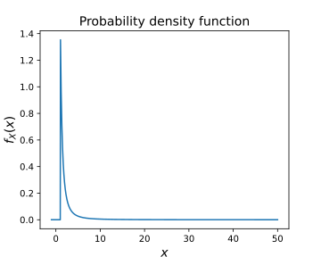
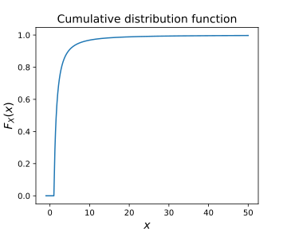
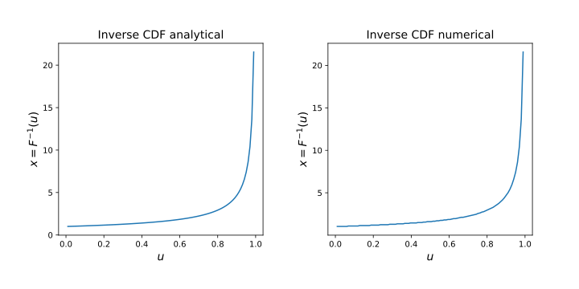
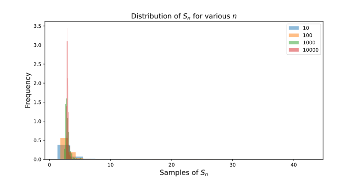
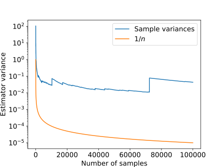

# AE567 Project 1 - Akshat Dubey

## 2

### Graphing the Pareto distribution function, its CDF and its inverse

The given probability density function is:

$$
p_X(x) = \left\{ \begin{array}{ll}
         \frac{\alpha}{x^{\alpha+1}} & \mbox{if $x \geq 1$}\\
        0 & \mbox{if $x < 1$}\end{array} \right..
$$

where $\alpha = 3/2 = 1.5$.

{width=300px}

We can integrate this function from 1 to x to get the cumulative distribution function for $x \geq 1$, and any $x < 1$ will be 0. The CDF is:

$$
F_X(x) = \left\{ \begin{array}{ll}
         1 - \frac{1}{x^{\alpha}} & \mbox{if $x \geq 1$}\\
        0 & \mbox{if $x < 1$}\end{array} \right..
$$

{width=300px}

$\pagebreak$

We can sample the distribution using the inverse CDF, so first we need to find the inverse of the CDF. This way we can input a random number in $[0, 1)$ and get a value of x. This inverse can been found analytically, it is good to check against a numerical method. The numerical method does the following steps:

- Generate CDF values for a range of x, the CDF will be in the range $[0, 1)$.
- Given a random number $u$ in $[0, 1)$ that represents the value of the CDF, we find the value of all the $x$'s such that $F_X(x) > u$.
- Take the minimum of these values, this is the value of x that corresponds to the value of the CDF.

For the analytical inverse of the CDF, we can ignore the piecewise condition $x < 1$ since the CDF is only valid in $[0, 1)$.

The analytical inverse CDF is:

$$
F_x^{-1}(x) = -\frac{1}{(x-1)^{1/\alpha}}
$$

Since both results match, we can now go ahead and use the inverse CDF to sample the distribution for use in Monte-Carlo simulations.

$\pagebreak$

### Distribution of the Monte Carlo Estimator for various values of n

To generate a Monte Carlo estimate of the expectation of the distribution, we use $n$ samples of the distribution and take the average of these samples. To see how the distribution of the Monte Carlo estimate changes with $n$, we can plot the distribution of 500 repeated sequences of Monte Carlo estimate for various values of $n$.

{width=350px}

The distribution of the Monte Carlo estimate is a normal distribution with mean equal to the true expectation of the distribution and variance equal to the variance of the distribution divided by $n$. The distribution of the Monte Carlo estimates for various values of $n$ is shown in the following figure:

We can observe that as $n$ increases, the distribution of the Monte Carlo estimate becomes more concentrated around the true expectation of the distribution. This is consistent with the fact that the variance of the Monte Carlo estimate decreases with $n$. This indeed seems like an asymptotic distribution since the frequency/probability of values drops off as we move away from the mean, approaching 0.

To get a better idea of the convergence, we can plot the variance of the Monte Carlo estimate as a function of $n$.

{width=400px}

We observe that while the general trend follows $1/n$, there are multiple spikes in the variance througout the range of $n$. This is not expected, but can be explained by the asymptotic behavior of the sampler we have created, which approaches infinity as the sampling values get close to 1. If for a certain $S_n$, there happens to be a sample randomly generated that is close to 1, the value of $x$ will be extremely high, causing the variance to spike.

$$
$$
