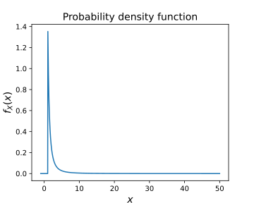
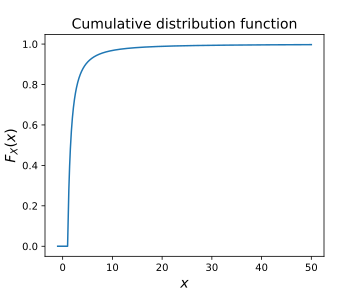
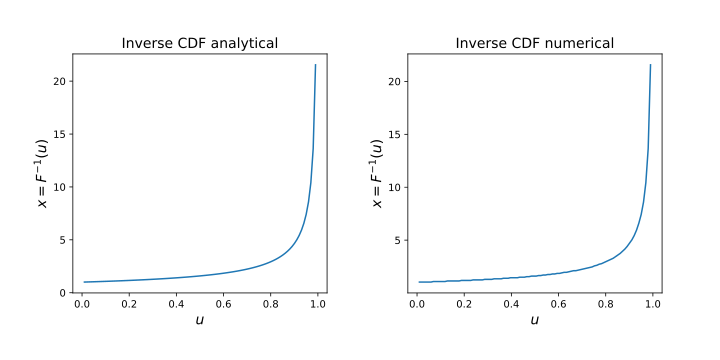
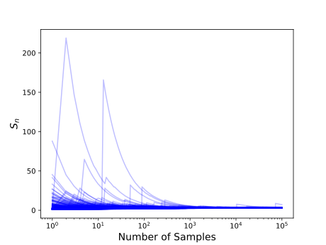
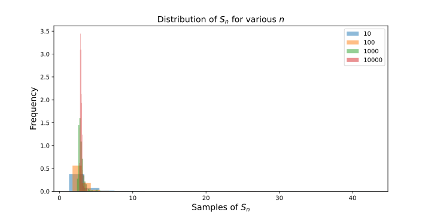
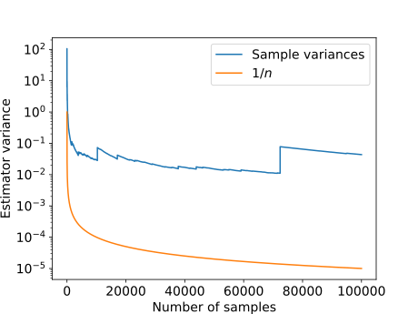

# AE567 Project 1 - Akshat Dubey

## 2 Warmup: life without a CLT

### Graphing the Pareto distribution function, its CDF and its inverse

The given probability density function is:

$$
p_X(x) = \left\{ \begin{array}{ll}
         \frac{\alpha}{x^{\alpha+1}} & \mbox{if $x \geq 1$}\\
        0 & \mbox{if $x < 1$}\end{array} \right..
$$

where $\alpha = 3/2 = 1.5$.

{width=300px}

The aim is to find the Expectation of this function via Monte Carlo, but we have no way to sample it. To sample it, we will need to generate its inverse CDF. The first step to getting there is to get its CDF. We can integrate this function from 1 to x to get the cumulative distribution function for $x \geq 1$, and any $x < 1$ will be 0. The CDF is:

$$
F_X(x) = \left\{ \begin{array}{ll}
         1 - \frac{1}{x^{\alpha}} & \mbox{if $x \geq 1$}\\
        0 & \mbox{if $x < 1$}\end{array} \right..
$$

{width=300px}

$\pagebreak$

We can sample the distribution using the inverse CDF, so first we need to find the inverse of the CDF. This way we can input a random number in $[0, 1)$ and get a value of x. This inverse can been found analytically, it is good to check against a numerical method. The numerical method does the following steps:

- Generate CDF values for a range of x, the CDF will be in the range $[0, 1)$.
- Given a random number $u$ in $[0, 1)$ that represents the value of the CDF, we find the value of all the $x$'s such that $F_X(x) > u$.
- Take the minimum of these values, this is the value of x that corresponds to the value of the CDF.

For the analytical inverse of the CDF, we can ignore the piecewise condition $x < 1$ since the CDF is only valid in $[0, 1)$.

The analytical inverse CDF is:

$$
F_x^{-1}(x) = -\frac{1}{(x-1)^{1/\alpha}}
$$

Since both results match, we can now go ahead and use the inverse CDF to sample the distribution for use in Monte-Carlo simulations.

It is also useful to analytically calculate other properties of the distribution, such as the true mean and variance so we can compare the Monte Carlo estimate to the true value. The true mean of the distribution is:

$$
\begin{aligned}
\mu &= \int_1^{\infty} x \frac{\alpha}{x^{\alpha+1}} dx \\
\text{plugging in values for } \alpha &= 3/2 \text{ we get}\\
\mu &= 3
\end{aligned}
$$

$\pagebreak$

The true variance of the distribution using reference: [ProofWiki](https://proofwiki.org/wiki/Variance_of_Pareto_Distribution):

$$
\begin{aligned}
Var[X] &= E[X^2] - E[X]^2 \\
\text{where}& \\
E[X^2] &= \int_1^{\infty} x^2 \frac{\alpha}{x^{\alpha+1}} dx \\
&= \infty \\
\end{aligned}
$$

### Distribution of the Monte Carlo Estimator for various values of n

To generate a Monte Carlo estimate of the expectation of the distribution, we use $n$ samples of the distribution and take the average of these samples. To see how the distribution of the Monte Carlo estimate changes with $n$, we can plot the distribution of 500 repeated sequences of Monte Carlo estimate for various values of $n$ with 100001 samples in each sequence.

{width=350px}

The distribution of the Monte Carlo estimates for various values of $n$ is shown in the following figure:

$\pagebreak$

The distribution of the Monte Carlo estimate is not a normal distribution, since it is not symmetric and seems to extend out more on the positive side. However, its expectation does converge to the true mean of the distribution as $n$ becomes larger. Given a large enougn $n$, the distribution of the Monte Carlo estimate will be centered around the true mean of the distribution. It is also clear that the mean is finite and the probability of it going to infinity is 0. Specifically if $X_i$ is a sequence of i.i.d. random variables with finite mean $\mu$, then the strong law of large numbers states:

$$
\mathbb P(\lim_{n \to \infty} \frac{1}{n} \sum_{i=1}^n X_i = \mu) = 1
$$

Hence, using the strong law of large numbers we can conclude that the partial means converge to the true mean and we can say that the Monte Carlo estimate converges almost surely to the true mean of the distribution.

We can observe that as $n$ increases, the distribution of the Monte Carlo estimate becomes more concentrated around the true expectation of the distribution. This is consistent with the fact that the variance of the Monte Carlo estimate decreases with $n$. This indeed seems like an asymptotic distribution since the frequency/probability of values drops off as we move away from the mean, approaching 0 but never really reaching it. This makes sense since the analytical variance of the distribution is infinite. Since the analytical variance is infinite, CLT will not apply here.

To get a better idea of the convergence, we can plot the variance of the Monte Carlo estimate as a function of $n$.

{width=400px}

We observe that while the general trend follows $1/n$, there are multiple spikes in the variance througout the range of $n$. The spikes are not expected for a general case of almost sure convergence, but can be explained by the asymptotic behavior of the sampler we have created, which approaches infinity as the sampling values get close to 1. If for a certain $S_n$, there happens to be a sample randomly generated that is close to 1, the value of $x$ will be extremely high, causing the variance to spike.

$\pagebreak$
