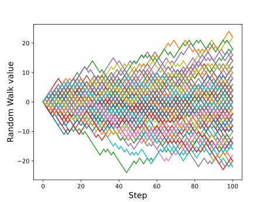
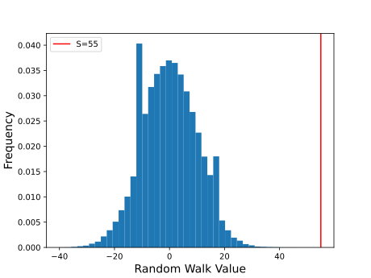

$\pagebreak$

## 3.1 1-D Bernoulli random walk

### 2.1.a

Visualization of an N-step 1-D Bernoulli random walk, with $n=1000$ steps.

{width=60%}

### 2.1.b

To perform a Monte Carlo estimate of $\mathbb P(S>10)$, we can simulate the random walk $10^5$ times with 100 steps in each trial and count the number of times the walk exceeds 10. The probability is then the ratio of the number of times the walk exceeds 10 to the total number of trials. This a simple indicator function that can be used with the Monte Carlo method.

Monte Carlo estimate with $10^5$ trials with 1000 steps in each walk for $\mathbb P(S>10)$ = 0.13579

$\pagebreak$

### 2.1.c

Before performing importance sampling, lets take a look at the distribution of the random walk with 100 steps.

{width=60%}

The distribution has

- Mean = 0.0838
- Variance = 100.63476096000001

As expected from a random walk, the distribution is normal with a mean $\approx 0$ and a standard deviation $\approx$ the number of time steps, which is the same as the number of steps in our case since we are not shrinking the time. However, we see that the probability of the walk exceeding 55 is very low, which makes it a good candidate for importance sampling.

To perform the importance sampling, we need a proposal distribution that has a high probability of exceeding 55. We can just use another random walk with a the probability $\mathbb P(X_j = 1) > \mathbb P(X_j = -1)$. If we ensure that the expected value of this new distribution is around 55, we can ensure that at least half the samples will exceed 55 so we can get a better estimate. To calculate the new probability for 100 steps, we can use a simple formula to estimate the value of a random walk given a probability $p$ :

$$
\begin{aligned}
\sum_{i=1}^{100} (p)(1) + (1-p)(-1) &> 55 \\
100(2p - 1) &> 55 \\
p &> 0.775
\end{aligned}
$$

So we can use a proposal distribution as a random walk with $\mathbb P(X_j = 1) = 0.8, \mathbb P(X_j = -1) = 0.2$ to get a better estimate for $S>55$. The Importance sampling estimate for $\mathbb P(S>55) = 7.966439961067404e-09$.

$\pagebreak$

### 2.1.d

Analytical expression for the probability of the random walk exceeding a threshold $T$ is a simple probability calculation for a binomial distribution:

$$
\mathbb P(S>T) = \sum_{i=T+1}^{100} \mathbb P(S = i) \\
$$

For $\mathbb P(S=i)$ we would have $j$ steps with +1 and $100-j$ steps with -1. Then this must hold true for $i, j$:

$$
\begin{aligned}
j - (100-j) &= i \\
2j - 100 &= i \\
j &= \frac{i+100}{2} \\
\end{aligned}
$$

Take note that we can only choose an integer from another integer, so values of j that are fractions will be ignored. This will happen when $i$ is odd, and there is no way for this random walk to generate a final step that is odd.

For n steps $\mathbb P(S=i)$ becomes:

$$
\begin{aligned}
\mathbb P(S=i) &= {100 \choose j} p^j (1-p)^{100-j}\\
substituting \quad p = (1-p) = 0.5\\
&= {100 \choose j} 0.5^{100}\\
substituting \quad j = \frac{i+100}{2} \\
&= {100 \choose \frac{i+100}{2}} 0.5^{100}\\
\end{aligned}
$$

Substituting this into $\mathbb P(S>T)$:

$$
\mathbb P(S>T) = \sum_{i=T+1}^{100} {100 \choose \frac{i+100}{2}} 0.5^{100}
$$

When $T=10$, evaluating this expression gives us $\mathbb P(S>10) = 1.356265e-01$, which is very close to the Monte Carlo estimate with a difference of only 0.16%.

When $T=55$, evaluating this expression gives us $\mathbb P(S>55) = 7.95266423689307e-09$, which is very close to the MC with importance sampling estimate with a difference of only 0.17%.

Interestingly, increasing the $\mathbb P(X_j = 1)$ too high in the prposal distribution closer to 0.9 actually causes the MC with importance sampling estimate to become worse and stray away further from the analytical estimate. This could be explained by the fact that the proposal distribution gets too far from the original distribution, and there isnt really any information left in the proposal distribution to calculate probabilities from. If we set this to 1, then the MC with importance sampling estimate becomes 0, which is not correct. So it makes sense to keep it close to the original distribution at 0.8.

$\pagebreak$

### 2.1.e.i

Standard errors for the estimates can be calculated as follows:

#### Monte Carlo for $\mathbb P(S>10)$:

<!-- ref: p56 -->

$\\$

Using $1_A(x)$ is the indicator function for the event $\mathbb P(S>10)$:

$$
\begin{aligned}
Var[S_n] &= \frac{1}{n} Var[1_A(x)]\\
std\quad error &= \sqrt{\frac{Var[1_A(x)]}{n}}\\
\end{aligned}
$$

Or alternatively, using the analytical probability of $p = \mathbb P(S>10)$:

$$
std\quad error = \sqrt{\frac{p(1-p)}{n}}\\
$$

Both evaluate to a similar result:

- Using indicator function: $1.083489e-03$
- Analytical using $p$ : $1.082737e-03$

#### MC with Importance Sampling for $\mathbb P(S>55)$:

<!-- ref: p58 -->

$$
\begin{aligned}
Var[S_n^{IS}]  &= \frac{1}{n} Var[1_A(x) w(x)]\\
std\quad error &= \sqrt{\frac{Var[1_A(x) w(x)]}{n}}\\
\end{aligned}
$$

$1_A(x)$ is the indicator function for the event $\mathbb P(S>55)$ and $w(x)$ is the weight for each sample calculated by dividing the original probability by the proposal probability. This evaluates to:

- MC with Importance Sampling standard error = 6.003709e-11

<!-- ref: p48 -->

For calculating the 95% confidence intervals using the central limit theorem, we need to first normalize the estimates so they become $\sim \mathcal{N}(0,1)$ as $n \to \infty$. This is done by subtracting the mean and dividing by the standard deviation to get the normalized estimate, $H_n$:

$$
H_n = \frac{S_n - \mathbb \mu}{\sigma/\sqrt{n}}\\
$$

A confidence interval is defined as the interval $[-z, z]$ such that $P_X(H_n \in [-z, z]) \geq 1 - \delta$ where $z$ is the z-score for the desired confidence level and $1 - \delta$ is the confidence level. For a 95% confidence interval, $1 - \delta = 0.95$ and $z = 1.96$ for $\mathcal{N}(0,1)$, which is a standard quantity that can be obtained from various online sources. Simplifying the expression for the probability defined above:

$$
\begin{aligned}
P_X(H_n \in [-z, z]) &= P_X(-z \leq H_n \leq z)\\
&= P_X(-z \leq \frac{S_n - \mathbb \mu}{\sigma/\sqrt{n}} \leq z)\\
&= P_X(\frac{-z\sigma}{\sqrt{n}} \leq S_n - \mu \leq + \frac{z\sigma}{\sqrt{n}})\\
&= P_X(-S_n - \frac{z\sigma}{\sqrt{n}} \leq - \mu \leq -S_n + \frac{z\sigma}{\sqrt{n}})\\
&= P_X(S_n + \frac{z\sigma}{\sqrt{n}} \geq \mu \geq S_n - \frac{z\sigma}{\sqrt{n}})\\
&= P_X(S_n - \frac{z\sigma}{\sqrt{n}} \leq \mu \leq S_n + \frac{z\sigma}{\sqrt{n}})\\
\end{aligned}
$$

The standard error calculated earlier is just $\frac{\sigma}{\sqrt{n}}$, which makes it easy to calculate this. The 95% confidence intervals calculated for the Monte Carlo and Importance Sampling estimates are:

- Monte Carlo for $\mathbb P(S>10)$ = [0.1337263621371712, 0.1379736378628288]
- MC with Importance Sampling for $\mathbb P(S>55)$ = [7.848767266908999e-09, 8.084112655225919e-09]

### 2.1.e.ii

Number of confidence intervals that contain the true value of the probability:

- Monte Carlo: 945
- MC with Importance Sampling: 956

The number of confidence intervals that contain the true value of the probability is very close to the expected value of 950 for both methods for a 95% confidence interval.

### 2.1.e.iii

Plotting an envelope of sequences of Monte Carlo estimates for $\mathbb P(S>10)$ and MC with Importance sampling for $\mathbb P(S>55)$.

Black represents the envelope, and the Blue shaded region represents the empirical 95% band.

The envelope of sequences of Monte Carlo estimates for $\mathbb P(S>10)$ is much wider than the envelope of sequences of MC with Importance sampling for $\mathbb P(S>55)$, which is expected since the standard error for the MC with Importance sampling is much lower than the standard error for the Monte Carlo estimate.
