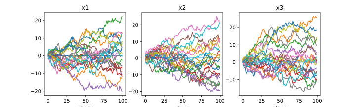

$\pagebreak$

## 3.2 3-D Gaussian random walk

### 2.2.a

Code implementation for a 3-D Gaussian random walk with $n=1000$ steps.

```python
def gaus_rw_steps(ntrials):
    """sample_generator, Generate random walks for a number of trials"""
    return np.random.randn(ntrials, NSTEPS, 3)


def gaus_rw_test(samples):
    """g_evaluator, Evaluate the indicator function for total distance travelled, S > 10"""
    return np.where(np.linalg.norm(np.sum(samples, axis=1), axis=1) > S, 1, 0)
```

The code above generates a 3-D Gaussian random walk with $NSTEPS=100$ steps.

`gaus_rw_steps` generates a set of steps for a random walk, taking note that now we are generating steps in 3 dimensions. It sampes from the standard normal distribution, which is a Gaussian distribution with $\mu=0$ and $\sigma=1$ and generates a value for each of the 3 dimensions of the walk for a set number of steps.

`gaus_rw_test` evaluates the indicator function for the total distance travelled, $S > 10$. It takes the sum of the steps in each walk for every dimension to get the total distance travelled per dimension, then takes the norm of the total distance travelled to get the total distance travelled in 3 dimensions. It then checks if the total distance travelled is greater than $S$ and returns 1 if it is, 0 otherwise for every sample provided to the function.

The norm we do here is equivalent to $|S|$:

$$
|S| = \sqrt{s_1^2 + s_2^2 + s_3^2}
$$

where $s_1, s_2, s_3$ are the total distance travelled in each dimension.

$$
\begin{aligned}
s_1 = \sum_{j=1}^{n} x_{1, j} \\
s_2 = \sum_{j=1}^{n} x_{2, j} \\
s_3 = \sum_{j=1}^{n} x_{3, j}
\end{aligned}
$$

Plotting 20 random walks generated by the code above for 100 steps in 3D:



### 2.2.b

Monte Carlo method to estimate the probability given an indicator function has been discussed in the previous exercises, so I will not go through the entire explanation agian. The indicator function here $1_A^{10}$ is given by:

$$
1_A^{10} = \left\{ \begin{array}{ll}
				 1 & \mbox{if $|S| > 10$}\\
				0 & \mbox{if $|S| \leq 10$}\end{array} \right..
$$

We can then generate samples and evaluate them using this indicator function, and then finally find the mean of the result to get our Monte Carlo estimate for the probability $|S| > 10$

Using a simple Monte Carlo method, the probability $\mathbb{P}(|S| > 10)$ is estimated as: 8.010300e-01.

### 2.2.c

Before we move on with the importance sampling, it makes sense to calculate the exact probability of the event $|S| > 55$ for the 3-D Gaussian random walk. This is given by:

$$
\mathbb{P}(|S| > 55) = \mathbb{P}(\sqrt{s_1^2 + s_2^2 + s_3^2} > 55)
$$

where $s_1, s_2, s_3$ are sums of 100 x $\sim \mathcal{N}(0, 1)$

hence giving them a probability density function of $\mathcal{N}(0, 100)$

normalizing them, we get

$$
\begin{aligned}
|S|_{norm} &= \sqrt{\frac{s_1^2 + s_2^2 + s_3^2}{100}} \\
|S|_{norm} &= \frac{\sqrt{s_1^2 + s_2^2 + s_3^2}}{10} \\
|S|_{norm} &= \frac{|S|}{10} \sim \mathcal{N}(0, 1)
\end{aligned}
$$

so the probability becomes

$$
\begin{aligned}
\mathbb{P}(|S| > 55) &= \mathbb{P}(\frac{|S|}{10} > \frac{55}{10}) \\
&= \mathbb{P}(|S|_{norm} > 5.5) \\
\end{aligned}
$$

Now our $|S|_{norm}$ should follow a chi distribution with 3 degrees of freedom, and we can calculate the probability of $|S|_{norm} > 5.5$ using the chi distribution to be $1.222653e-06$

Tryin to run a simple Monte Carlo estimator for this probability just gives us a value of 0, which means that we would need a very large sample size to get a good estimate for this probability.

For the importance sampling, we need a new proposal distribution with a PDF $\pi(S)$ such that it is $>0$ whenever $1_A^{10}(S)f_X (S) \neq 0$.

$$
\begin{aligned}
\mathbb P(S>55) &= \mathbb E_{f}[1_A^{55}(S)]\\
&= \int 1_A^{55}(S) f(S) dx\\
&= \int 1_A^{55}(S) \frac{f(S)}{\pi(S)} \pi(S) dx\\
&= \int 1_A^{55}(S) w(S) g(S) dx\\
&= \mathbb E_{\pi}[1_A^{55}(S) w(S)]\\
\end{aligned}
$$

Many variations of gaussians were tried for this, in an effort to increase the variance so that there is a higher chance of taking big steps. However, the main issue here is that there is always an equal probability of taking steps in any direction, so over the course of a few steps, they tend to cancel each other out, which makes sense as the mean of this distribution is 0.

A good proposal distribution here would ensure that steps are taken in the same direction, which means that the direction of the steps should be correlated. This would ensure that the steps do not cancel each other out, and the total distance travelled is more likely to be greater than 55.

I was not able to implement such a function in the time given, but I believe that a good proposal distribution would be a multivariate gaussian with a covariance matrix that is not diagonal, and has a high correlation between the dimensions. This would ensure that the steps are taken in the same direction, and the total distance travelled is more likely to be greater than 55.

### 2.2.d

Using $1_A^{10}(S)$ is the indicator function for the event $\mathbb P(|S| > 10)$:

$$
\begin{aligned}
Var[S_n] &= \frac{1}{n} Var[1_A^{10}(S)]\\
std\quad error &= \sqrt{\frac{Var[1_A^{10}(S)]}{n}}\\
\end{aligned}
$$

Monte Carlo eror for the probability $\mathbb{P}(|S| > 10)$ is estimated as: 9.999900e-06.
