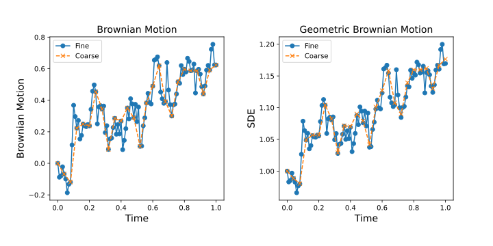

$\pagebreak$

## 4 Multilevel Monte Carlo and Control Variates for Stochastic ODEs

**Q**: What is the distribution of $\Delta W_n$ ?

**A**: $\Delta W_n \sim \mathcal N(0, \Delta t)$

**Explanation**:

As per property 3, $W(t + \Delta t) - W(t) \sim \mathcal N (0, \Delta t)$

And

$$
\begin{aligned}
\Delta W_n &= W(t_{n+1}) - W(t_n) \quad &(discrete) \\
&= W(t + \Delta t) - W(t) &(original) \\
&\sim \mathcal N(0, \Delta t)
\end{aligned}
$$

Basically here, the increment here is just 1 step of $\Delta t$, which makes the variance of the increment of the Weiner process $\Delta W_n$ also equal to $\Delta t$.

## 4.1 Geometric Brownian Motion

### 1

The Geometric Browninan motion is simulated by first generating a sequence of simple brownian motion paths, where each step is $\sim \mathcal N (0, 1)$, and each step is added to the previous over time to generate a full path. This is repeated here for 1000 paths, and then we can then use those paths with the Euler-Maruyama method to scale the _diffusion_ term of the SDE over time, essentially adding to the variance of the SDE. Upon simulating 1000 paths over T[0, 1] with $\Delta t = 0.01$, and then plugging them into the Euler-Maruyama method, we get the following plot:

{width=60%}

The mean and variance of $Y(1)$ using the simulation with Euler-Maruyama is calculated by simply finding the mean of the paths at $t=1$ and the variance of the paths at $t=1$. The mean at $t=1$ corresponds to a Monte Carlo estimator for the expected value of $Y(1)$. The variance at $t=1$ is just the variance of the samples, not the variance of the Monte Carlo estimator. The mean and variance of $Y(1)$ using the simulation is:

- Mean: 1.0513250656841955
- Variance: 0.045393795029522364

Instead of simulating using the whole time interval $[0, 1]$ using Euler-Maruyama, we can also use the analytical equation to solve for $Y(1)$ directly by just using the value of all the paths of the brownian motion at $t=1$. The mean and variance of $Y(1)$ using this method is:

- Mean: 1.051286135353164
- Variance: 0.04547183854880979

And finally, we can also compute the full analytical solution for the mean and variance of $Y(1)$ without using any sampled data, which is:

$$
\begin{aligned}
Y_t &= Y_0 exp((\mu - \frac{\sigma^2}{2})t + \sigma W_t) \\
\text{sustituting}\quad & \mu = 0.05, \sigma = 0.2, Y_0 = 1, t = 1 \\
Y(1) &= 1 \times exp((0.05 - \frac{0.2^2}{2}) \times 1 + 0.2 \times W(1)) \\
&= exp(0.03 + 0.2 W(1)) \\
&= exp(0.03)  exp(0.2 W(1)) \\
\text{we know that } W(t) &\text{ is normally distributed with mean 0 and variance } t \\
Y(1) &= exp(0.03) exp(0.2 \mathcal N(0, 1)) \\
&= exp(0.03) exp(\mathcal N(0, 0.04)) \\
\text{using } E[exp(X)] &= exp(\mu + \sigma^2/2) \\
\text{and } Var(exp(X)) &= (exp(\sigma^2) - 1) exp(2\mu + \sigma^2) \\
Y(1) &= exp(0.03) Lognormal(exp(0.04/2), (exp(0.04) - 1) exp(0.04)) \\
&= exp(0.03) Lognormal(1.0202, 0.0425) \\
&= 1.0305 Lognormal(1.0202, 0.0425) \\
&= Lognormal(1.0513, 0.0451)
\end{aligned}
$$

- Mean: 1.0512710963760241
- Variance: 0.04510288078157963

The mean and variance of $Y(1)$ using all 3 methods are very close, which is a good indicator that the simulation is working as expected.

Now to get the variance of a Monte Carlo estimator of the mean, we can just use the formula for the variance of a sample mean, assuming $\bar Y$ is the sample mean of $Y(1)$ after simulating $n$ paths using Euler-Maruyama:

$$
\begin{aligned}
\text{Var}(\bar Y) &= \frac{\text{Var}(Y)}{n} \\
&= \frac{0.045393795029522364}{1000} \\
&= 4.539379502952236e-05
\end{aligned}
$$

### 2

The code can be adjusted by

1. Generating a fine sample
2. Coarsening it every 4 steps to generate a coarse sample. Since the coarse sample is generated by picking out one of every 4 steps, they will share the underlying realization of the Wienner process.
3. We can then use the coarse samples to simulate the Geometric Brownian motion using the Euler-Maruyama method, but now using a time step of $4\Delta t$.

Taking a single path from the coarse and fine samples:

We can observe here that for just the Brownian Motion, coarse samples are exactly the same as the fine samples every 4 time steps, which is expected since they share the same underlying realization of the Wienner process.

However, when looking at the Geometric Brownian motion simulated by the Euler-Maruyama method using the coarse and fine samples, we can see that the paths are not exactly the same, but they are very close to each other. This is expected since the coarse samples will have integration errors that will accumulate over time, but the paths will still be close to each other since they share the same underlying realization of the Wienner process.

### 3

For a multilevel Monte Carlo estimator, we will need multiple fidelities of the underlying realization that we use to simulate our SDE. Since we have already displayed how to coarsen the samples while still retaining the underlying realization, we will use the same process to generate 4 levels of fidelities, just increasing the time step by a factor of 4 each time we coarsen the samples. We can then use the Euler-Maruyama method to simulate the Geometric Brownian motion using the samples at each level of fidelity of coarseness, and then use the multilevel Monte Carlo estimator to estimate the mean and variance of $Y(1)$.

$$
E[Y(1)] = E[Y(1)_2] + \sum_{l=3}^{5} E[Y(1)_l - Y(1)_{l-1}] \\
$$

Where $Y(1)_l$ is the set of values of $Y(1)$ using the Euler-Maruyama method with brownian motion samples at $\Delta t = 4^{-l}$. At every level besides $l=2$, we will be using the same underlying realization for generating the coarse($l-1$) and fine ($l$) samples, so the coarse and fine estimators for each level will be correlated. Take note that the samples generated at each level will be independent. In addition, the the number of samples needed for each level will be different as well, which is the point of MLMC as we want to reduce the number of samples taken at the finer levels.

Modifying the code to estimate $E[P]$ instead of $E[Y(1)]$ is just a matter of using the equation shown in the project description calculate the value of $P$ for each value of $Y(1)$ for all the samples of browninan motion at every level and then using the Monte-Carlo method to estimate the final value of $E[P]$.

For each level, the process to generate data for the estimators is as follows:

- Level 2:
  - Generate brownian motion samples using $\Delta t = 4^{-2}$ and the appropriate number of samples.
  - Use Euler-Maruyama to simulate the SDE using Geometric Brownian motion for all samples and get $Y(1)_2$.
  - Use the all the simulated paths to calculate the value of $P_2$.
  - Calculate the mean of all the values in $Y(1)_2$ and $P_2$ to get the final estimate for $E[Y(1)_2]$ and $E[P_2]$.
- All other levels
  - Generate fine brownian motion samples using $\Delta t = 4^{-l}$ and the appropriate number of samples
  - Generate coarse brownian motion samples by coarsening the fine samples by a factor of 4.
  - Use Euler-Maruyama to simulate the SDE using Geometric Brownian motion for all samples and get $Y(1)_l$ and $Y(1)_{l-1}$.
  - Use the all the simulated paths to calculate the value of $P_l$ and $P_{l-1}$.
  - For each simulated path in $Y(1)_l$ and $Y(1)_{l-1}$, calculate the difference between the two and then calculate the mean difference between all the simulated paths to get the estimate for $E[Y(1)_l - Y(1)_{l-1}]$.
  - For each value in $P_l$ and $P_{l-1}$, calculate the difference between the two and then calculate the mean difference between all the values to get the estimate for $E[P(1)_l - P(1)_{l-1}]$.

Once we have this data for all the levels, we can then use the equation for the multilevel Monte Carlo estimator described earlier to calculate the final estimate for $E[Y(1)]$ and $E[P]$.
