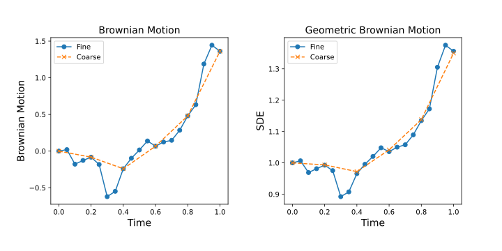

$\pagebreak$

## 4 Multilevel Monte Carlo and Control Variates for Stochastic ODEs

**Q**: What is the distribution of $\Delta W_n$ ?

**A**: $\Delta W_n \sim \mathcal N(0, \Delta t)$

**Explanation**:

As per property 3, $W(t + \Delta t) - W(t) \sim \mathcal N (0, \Delta t)$

And

$$
\begin{aligned}
\Delta W_n &= W(t_{n+1}) - W(t_n) \quad &(discrete) \\
&= W(t + \Delta t) - W(t) &(original) \\
&\sim \mathcal N(0, \Delta t)
\end{aligned}
$$

Basically here, the increment here is just 1 step of $\Delta t$, which makes the variance of the increment of the Weiner process $\Delta W_n$ also equal to $\Delta t$.

## 4.1 Geometric Brownian Motion

### 1

The Geometric Browninan motion is simulated by first generating a sequence of simple brownian motion paths, where each step is $\sim \mathcal N (0, 1)$, and each step is added to the previous over time to generate a full path. This is repeated here for 1000 paths, and then we can then use those paths with the Euler-Maruyama method to scale the _diffusion_ term of the SDE over time, essentially adding to the variance of the SDE. Upon simulating 1000 paths over T[0, 1] with $\Delta t = 0.01$, and then plugging them into the Euler-Maruyama method, we get the following plot:

{width=60%}

The mean and variance of $Y(1)$ using the simulation with Euler-Maruyama is calculated by simply finding the mean of the paths at $t=1$ and the variance of the paths at $t=1$. The mean at $t=1$ corresponds to a Monte Carlo estimator for the expected value of $Y(1)$. The variance at $t=1$ is just the variance of the samples, not the variance of the Monte Carlo estimator. The mean and variance of $Y(1)$ using the simulation is:

- Mean: 1.0513250656841955
- Variance: 0.045393795029522364

Instead of simulating using the whole time interval $[0, 1]$ using Euler-Maruyama, we can also use the analytical equation to solve for $Y(1)$ directly by just using the value of all the paths of the brownian motion at $t=1$. The mean and variance of $Y(1)$ using this method is:

- Mean: 1.051286135353164
- Variance: 0.04547183854880979

And finally, we can also compute the full analytical solution for the mean and variance of $Y(1)$ without using any sampled data, which is:

$$
\begin{aligned}
Y_t &= Y_0 exp((\mu - \frac{\sigma^2}{2})t + \sigma W_t) \\
\text{sustituting}\quad & \mu = 0.05, \sigma = 0.2, Y_0 = 1, t = 1 \\
Y(1) &= 1 \times exp((0.05 - \frac{0.2^2}{2}) \times 1 + 0.2 \times W(1)) \\
&= exp(0.03 + 0.2 W(1)) \\
&= exp(0.03)  exp(0.2 W(1)) \\
\text{we know that } W(t) &\text{ is normally distributed with mean 0 and variance } t \\
Y(1) &= exp(0.03) exp(0.2 \mathcal N(0, 1)) \\
&= exp(0.03) exp(\mathcal N(0, 0.04)) \\
\text{using } E[exp(X)] &= exp(\mu + \sigma^2/2) \\
\text{and } Var(exp(X)) &= (exp(\sigma^2) - 1) exp(2\mu + \sigma^2) \\
Y(1) &= exp(0.03) Lognormal(exp(0.04/2), (exp(0.04) - 1) exp(0.04)) \\
&= exp(0.03) Lognormal(1.0202, 0.0425) \\
&= 1.0305 Lognormal(1.0202, 0.0425) \\
&= Lognormal(1.0513, 0.0451)
\end{aligned}
$$

- Mean: 1.0512710963760241
- Variance: 0.04510288078157963

The mean and variance of $Y(1)$ using all 3 methods are very close, which is a good indicator that the simulation is working as expected.

Now to get the variance of a Monte Carlo estimator of the mean, we can just use the formula for the variance of a sample mean, assuming $\bar Y$ is the sample mean of $Y(1)$ after simulating $n$ paths using Euler-Maruyama:

$$
\begin{aligned}
\text{Var}(\bar Y) &= \frac{\text{Var}(Y)}{n} \\
&= \frac{0.045393795029522364}{1000} \\
&= 4.539379502952236e-05
\end{aligned}
$$

### 2

The code can be adjusted by

1. Generating a fine sample
2. Coarsening it every 4 steps to generate a coarse sample. Since the coarse sample is generated by picking out one of every 4 steps, they will share the underlying realization of the Wienner process.
3. We can then use the coarse samples to simulate the Geometric Brownian motion using the Euler-Maruyama method, but now using a time step of $4\Delta t$.

Taking a single path from the coarse and fine samples and setting the $\Delta t$ to 0.05 instead of 0.01 from earlier to make it easier to see the coarsening:

We can observe here that for just the Brownian Motion, coarse samples are exactly the same as the fine samples every 4 time steps, which is expected since they share the same underlying realization of the Wienner process.

However, when looking at the Geometric Brownian motion simulated by the Euler-Maruyama method using the coarse and fine samples, we can see that the paths deviate slightly over time, but they still are very close to each other. This is expected since the coarse samples will have numerical integration errors due to the randomness of the stochastic process that will accumulate over time, but the paths will still be close to each other since they share the same underlying realization of the Wienner process.

### 3

#### Four level MLMC estimator

For a multilevel Monte Carlo estimator, we will need multiple fidelities of the underlying realization that we use to simulate our SDE. Since we have already displayed how to coarsen the samples while still retaining the underlying realization, we will use the same process to generate 4 levels of fidelities, just increasing the time step by a factor of 4 each time we coarsen the samples. We can then use the Euler-Maruyama method to simulate the Geometric Brownian motion using the samples at each level of fidelity of coarseness, and then use the multilevel Monte Carlo estimator ($S_N^{MLMC}(Y)$) to estimate the expectation $Y(1)$.

$$
S_N^{MLMC}(Y) = E[Y(1)_2] + \sum_{l=3}^{5} E[Y(1)_l - Y(1)_{l-1}] \\
$$

Where $Y(1)_l$ is the set of values of $Y(1)$ obtained using the Euler-Maruyama method with brownian motion samples at $\Delta t = 4^{-l}$ and $E[Y(1)_l]$ is simply the mean of those sets of values. $N$ is a vector that contains the number of samples to be taken at each level. At every level besides $l=2$, we will have coarse($l-1$) and fine ($l$) samples, generated using the same underlying realization for the Brownian motion so the coarse and fine estimators for each level are correlated. Take note that the samples generated at each level will be independent of other levels. In addition, the the number of samples needed for each level can be different as well, which is the point of MLMC as we want to reduce the number of samples taken at the finer levels.

Modifying the code to estimate $E[P]$ instead of $E[Y(1)]$ is just a matter of using the equation shown in the project description calculate the value of $P$ for each value of $Y(1)$ for all the samples of browninan motion at every level and then using the Monte-Carlo method to estimate the final value of $E[P]$.

For each level, the process to generate data for the estimators is as follows:

- Level 2:
  - Generate brownian motion samples using $\Delta t = 4^{-2}$ and the appropriate number of samples.
  - Use Euler-Maruyama to simulate the SDE using Geometric Brownian motion for all samples and get $Y(1)_2$.
  - Use the all the simulated paths to calculate the value of $P_2$.
  - Calculate the mean of all the values in $Y(1)_2$ and $P_2$ to get the final estimate for $E[Y(1)_2]$ and $E[P_2]$.
- All other levels
  - Generate fine brownian motion samples using $\Delta t = 4^{-l}$ and the appropriate number of samples
  - Generate coarse brownian motion samples by coarsening the fine samples by a factor of 4.
  - Use Euler-Maruyama to simulate the SDE using Geometric Brownian motion for all samples and get $Y(1)_l$ and $Y(1)_{l-1}$.
  - Use the all the simulated paths to calculate the value of $P_l$ and $P_{l-1}$.
  - For each simulated path in $Y(1)_l$ and $Y(1)_{l-1}$, calculate the difference between the two and then calculate the mean difference between all the simulated paths to get the estimate for $E[Y(1)_l - Y(1)_{l-1}]$.
  - For each value in $P_l$ and $P_{l-1}$, calculate the difference between the two and then calculate the mean difference between all the values to get the estimate for $E[P(1)_l - P(1)_{l-1}]$.

Once we have this data for all the levels, we can then use the equation for the multilevel Monte Carlo estimator described earlier to calculate the final estimate for $E[Y(1)]$ and $E[P]$.

For calculating the variance of the MLMC estimator, we can just divide each level's variance by the number of samples used at that level and then sum them up to get the final variance of the MLMC estimator.

$$
Var[S_N^{MLMC}(Y)] = \frac{Var(Y(1)_2)}{N_2} + \sum_{l=3}^{5} \frac{Var[Y(1)_l - Y(1)_{l-1}]}{N_l}
$$

Where $N_l$ is the number of samples used at level $l$. For this project, we will use the same number of samples at each level, which is $10^5$.

After running the MLMC estimator, we get the following results for $E[Y(1)]$:

- $E[Y(1)]$: 1.0511142682675358
- Difference from analytical solution: 0.01%

Which means that our MLMC estimator is working as expected.

$\pagebreak$

**Discussing Variance of the MLMC estimator**

After running the MLMC estimator, we get the following results for variance:

Variance for MLMC estimator:

- $Y(1)$ : $4.4887287222994214e-07$
- $P$ : $2.1419784299969563e-07$

We can notice that the variance of each level of the MLMC estimator is decreasing as we go to the finer levels. This is expected, since at levels besides the coarsest level, we are taking the variance of the difference between the coarse and fine values of $Y(1)$, which are generated using the same underlying realiziation of the brownian motion. When we calculate the correlation between the coarse and fine simulations at levels [3, 4, 5], we can see that they are $\sim 1$ for both $Y(1)$ and $P$, which explains the low vaiance of the difference between the coarse and fine simulations. This is a good indicator that the MLMC estimator will work well for this problem since it means that we can extract a lot of the same information from low fidelity simulations as we can from high fidelity simulations.

Also, notice that variance reduces as the number of samples used increases and the cost of running a simulation using larger time steps at lower levels is lower. This means that we can use more samples at lower levels to reduce the variance of the MLMC estimator even further without incurring a large additional cost. On the other hand, we can also reduce the overall cost of the MLMC estimator while keeping variance the same by using fewer samples at the higher(finer) levels and balaning it out by taking more samples at the lower(coarser) levels.

$\pagebreak$

**Discussing the expectation of the MLMC estimator**

After running the MLMC estimator, we get the following results for expectation:

Expectation for MLMC estimator:

- $Y(1)$ : $1.0511142682675358$
- $P$ : $0.10490297238106877$

We see a similar trend in the expectation of the MLMC estimator as we did with the variance. The expectation of the MLMC estimator is decreasing as we go to the finer levels, which is expected. Beside the coarsest level, we are taking the mean of the difference between the coarse and fine values of $Y(1)$ and $P$, which are expected to be low because simulations that generate both coarse and fine values of $Y(1)$ and $P$ are generated using the same underlying realization of the brownian motion. We can notice that the coarsest level has almost all of the total expectation, which is a good indicator that we can extract most of the information we need from low fidelity simulations. The higher levels are there to just correct the low fidelity simulations and push the expectation of the MLMC estimator closer to the true value of $Y(1)$ and $P$.

$\pagebreak$

### 4

To estimate the theoretical cost, it makes sense to use the payoff function for the stock, $P$ since that is ultimately what we are interested in. However, $P$ is only calculated at the end once we have simulated $Y$ over the total time $T$ so its cost is constant and only changes if we change the number of levels in our MLMC. Hence here we will only consider the cost of $Y(T)$ where $T$=1. The cost of the MLMC estimator is the sum of the cost of running the simulations at each level. The cost of running the simulations at each level $l$ is proportional to the number of samples needed at each level $N_l$ and the fidelity of the simulation, determined by the inverse of $\Delta t$. The number of samples at each level is the same at $10^5$ and the inverse of the fidelity of a single simulation at a level is $(\Delta t)_l^{-1} = (4^{-l})^{-1} = 4^l$. Take not that for $l > 2$, we have to add the cost associated with both the coarse and fine simulation:

$$
\begin{aligned}
C_{total}^{MLMC} &= C_2 + C_3 + C_4 + C_5 \\
&= N_2 (\Delta t)_2^{-1} \sum_{l=3}^{5} N_l ((\Delta t)_l^{-1} + (\Delta t)_{l-1}^{-1}) \\
&= 10^5 \times 4^2 + (10^5 (4^3 + 4^2) + 10^5 (4^4 + 4^3) + 10^5 (4^5 + 4^4))\\
&= 1600000 + (8000000 + 32000000 + 128000000) \\
&= 169600000
\end{aligned}
$$

Referencing the notes **`multilevel_monte_carlo.pdf`** from the course, the problem for finding the optimal sample allocation is an optimization problem which can be solved by using a lagrangian formulation: Take note that in the notes, the summation starts with $l=0$ but in this project, the summation starts with $l=2$ because of the convention we have followed till now.

$$
L(N, \lambda^2) = \sum_{l=2}^{L} \frac{V_l}{N_l} + \lambda^{-2}(\sum_{l=2}^{L} N_l C_l - C_{total}^{MLMC})
$$

Where:

- $V_l$ is the variance of the MLMC estimator for $P$ at level $l$
  - for $l > 2$: variance of the difference between the coarse and fine estimations
- $N_l$ is the number of samples at level $l$
- $C_{total}^{MLMC}$ is the total cost of running the simulations at all levels as we calculated earlier
- $C_l$ is the cost of running the simulations at level $l$ as we saw earlier when calculating $C_{total}^{MLMC}$
- $\lambda$ is the lagrange multiplier

Solving this for $N_l$ after setting the derivative of $L$ with respect to $N_l$ to 0, we get:

$$
N_l^{opt} = \lambda \sqrt{\frac{V_l}{C_l}}
$$

And the variance of the estimator (the accuracy $\epsilon^2$) using this allocation is:

$$
\begin{aligned}
Var[S_N^{MLMC}(Y)] &= \epsilon^2 = \lambda^{-1}\sum_{l=0}^{L} \sqrt{V_l C_l}\\
\text{which gives us} \\
\lambda &= \epsilon^{-2} \sum_{l=0}^{L} \sqrt{V_l C_l}\\
\end{aligned}
$$

Using these equations, we can calculate the $\lambda$ for a given $\epsilon^2$ and then use that to calculate the optimal number of samples $N_l$ at each level.

For example, for a target accuracy(variance) of $\epsilon^2 = 10^{-8}$ for $P$, we can calculate the optimal number of samples at each level by first calculating $\lambda$, using the variance of $P$ at each level. This comes out to be $\lambda = 22955386440.88965$. Using this $\lambda$, we can then calculate the optimal number of samples at each level to make the samples realistic, we take the ceiling of the resulting $N_l^{opt}$:

- $N_2^{opt}$ = 2653380
- $N_3^{opt}$ = 42486
- $N_4^{opt}$ = 10689
- $N_5^{opt}$ = 2674

### 5

The variance for the highest fidelity Monte Carlo esimate of $P$ would be at $l=5$ with the fine simulation. Let this be $P_5^{fine}$. This variance is given by:

$$
Var[S_N^{MC}(P_5^{fine})] = \frac{Var[P_5^{fine}]}{N_5}
$$

Hence, if we want to achieve a certain variance $Var[S_N^{MC}(P_5^{fine})]$ of $\epsilon^2$ in the highest fidelity Monte Carlo estimate of $P = P_5^{fine}$, we can estimate the Number of samples $N_5^{\epsilon}$ needed for this is:

$$
N_5^{\epsilon} = \frac{Var[P_5^{fine}]}{\epsilon^2}
$$

Using this equation, and using variance of $P_5^{fine}$ calculated using the MLMC estimator we ran earlier, $Var[P_5^{fine}] = 0.021544072463013958$, $N_5^{\epsilon} = 2154408.0$

The overall costs for both Monte Carlo and MLMC would just be their respective costs to achieve the same variance $\epsilon^2$. The cost of the Monte Carlo estimator is just the cost of running the simulation at the highest fidelity level, $C_{hf}$ multiplied by the number of samples needed at that level, which is $N_5^{\epsilon}$. The cost of the MLMC estimator is just the total cost of running the simulations at all levels, which is $C_{total}^{MLMC}$ for a certain optimal sample allocation $N^{opt}$.

Therefore, to calculate the equivalent number of high-fidelity evaluations for MLMC when compared to a Monte Carlo estimator, we can just divide the cost of the MLMC estimator by the cost of a single run of the high fidelity simulation Monte Carlo estimator. In this case, that would be:

$$
\text{Equivalent number of high-fidelity evaluations} = \frac{C_{total}^{MLMC}}{C_{hf}}
$$

$\pagebreak$

Plotting Estimator variance vs. Equivalent number of high-fidelity evaluations for both Monte Carlo and Multilevel Monte Carlo:

{width=60%}

In the graph we can see clearly that as we require higher accuracy, the equivalent number of high-fidelity evaluations for both Monte Carlo and Multilevel Monte Carlo increases. However, we see that to achieve the same accuracy, MLMC takes almost 2 orders of magnitude fewer evaluations than Monte Carlo. This is expected since the problem in question shows high correlation between the coarse and fine simulations, which means that MLMC can extract a lot of the same information from low fidelity simulations as it can from high fidelity simulations, requiring fewer equivalent high fidelity evaluations to achieve the same accuracy.
