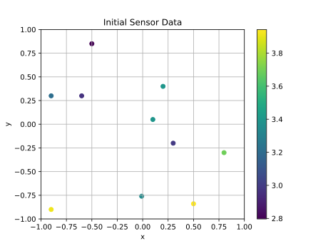
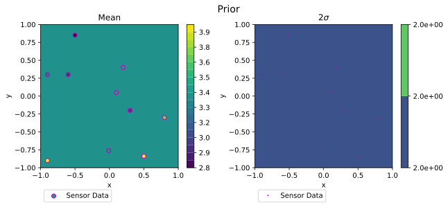
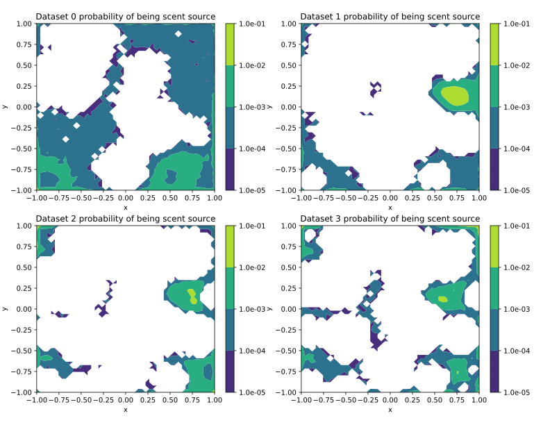
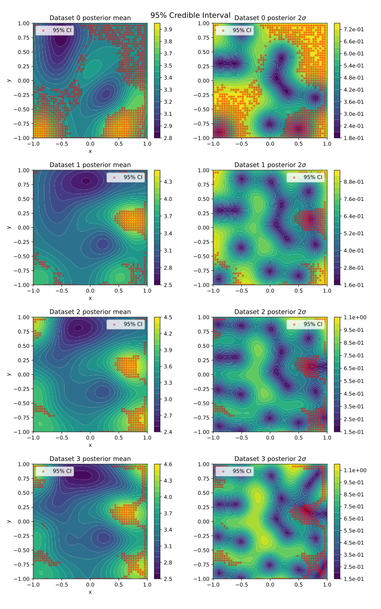
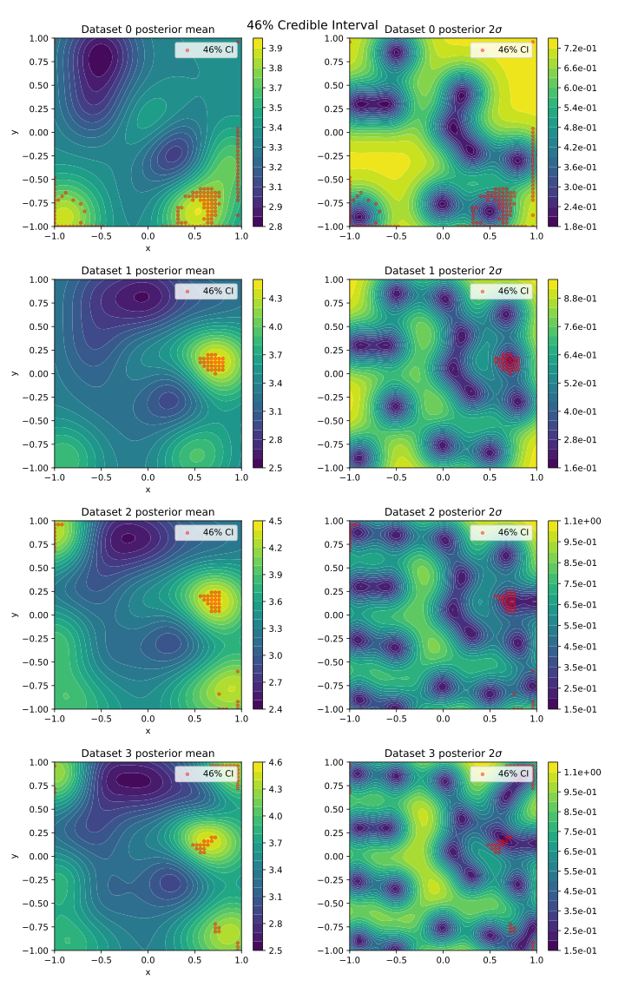

# AE567 Project 2 Part 1: Bayesian Inference and Decisions

# Akshat Dubey

## 1 Find the source!

## 1.1 Problem description

### What is uncertain in this problem?

We want the location(x, y coordinates) of the source of the scent in the 2D plane, which would require us to be able to predict how the scent dissipates in order to trace it back to the source. We are uncertain how the scent dissipates in the 2D plane, which in turn makes us uncertain about the strength of the scent at any location besides at the data points. Here is a visualization of the field of play:

{width=60%}

### What are you trying to learn?

How the scent dissipates with respect to any point on the 2D plane. Specifically, a distribution of the strength of the scent at any given location in the field of play. This can be done by building a posterior distribution of the scent in the field of play by carefully selecting a covariance kernel that relates the scent at any point to the scent at any other point with a covariance matrix.

### What quantities can you use to summarize your uncertainty?

The random variable that we want to predict is the strength of the scent across the field of play. Here, I use $2\sigma$ or $\sigma^2$ of the posterior distribution(predicted distribution of scent strength) at every point in the playing field to represent its uncertainty. $2\sigma$ is used for plotting the uncertainty to be consistent with the in-class notebooks. However $\sigma^2$ is used for the acquisition function because it is the variance of the posterior distribution which is given directly by the `gpr` function, making it less computationally expensive compared to $2\sigma$ which requires a square root of the variance matrix.

Besides representing the uncertainty in the predicted scent strength at each point, the uncertainty in the source of the scent can be represented as a probability distribution over the entire field of play, where each point in the field of play has a probability of that point being the source of the scent. We can then summarize this uncertainty by calculating a maximum credible interval for the desired level of credibility we want.

## 1.2 Formulating the problem

### How did you mathematically formulate this problem?

Mathematically, this problem can be formulated as a Gaussian Process where the gaussian process is a distribution over functions that describe the scent at any given point. Here, we start with a Gaussian prior that is described by the mean of the given data and a covariance described by a covariance kernel in the non parametric case. We then use this kernel to construct a posterior mean and covariance. The scent at any point then is a random variable that is distributed according to the posterior distribution at that point. The posterior distribution is a multivariate Gaussian distribution with a mean and a covariance matrix. The mean is the predicted scent strength at any point and the covariance matrix can be used to determine the uncertainty in the predicted scent strength at any point. More details about the exact formulation of the problem can be found in section **1.4**.

### What is your search space?

The search space is the 2D plane of the field of play where the scent is being sensed. It is normalized to $[-1, 1] \times [-1, 1]$ and discretized into a grid of $50 \times 50$ points for a total of 2500 points total in the search space.

Since the kernel has some hyperparameters that can be tuned, the search space also includes the hyperparameters of the kernel. The hyperparameters are the parameters of the kernel that are not learned from the data, but are set by the user. These are the parameters that are used to describe the covariance between the scent at any two points in the field of play. The search space for the hyperparameters is the entire real line, since the hyperparameters can take any real value except for cases like the polynomial kernel where the degree of the polynomial needs to be an integer.

### How is the decision with regards to the next sensor request made?

To make a decision regards to the next sensor request, specifically which new points to acquire next, I use two acquisition functions that return points that:

1. Maximize reduction in variance: using posterior variance
2. Maximize expected improvement: using posterior mean and variance

Posterior variance is the uncertainty in the predicted value of the scent at every point in the field of play as described in **1.1**. Posterior mean is the mean of all the possible scent strengths at a certain point in the field of play based on the distribution over functions described by the Gaussian Process.
Based on the stage of data acquisition, I use one or both of these acquisition functions to decide the next sensor request.
These algorithms will be discussed in more detail in section **1.3**.

## 1.4 Description of GP

**NOTE: Placing section 1.4 before 1.3 because section 1.3 needs to refer to the choice of the kernel.**

### How did you choose the GP kernel (nonparametric) or basis functions/features (parametric)?

I chose nonparametric GP because for this problem, the goal is not to learn the parameters of the model which might be useful later, but to make predictions about the scent at any point so that we can arrive at the source of the scent. A nonparametric GP is more suited to this problem because we can ignore any underlying model and just go ahead and make predictions based on a covariance kernel. Specifically, we want to predict

$$
f(x, y) \mid \text{data}
$$

Where $f(x, y)$ gives a distribution of the strength of scent at an arbitrary point $(x, y)$ in our field of play. The GP is then a distribution over functions $f$ such that for the collection of 2500 discretized points in the $50 \times 50$ field of play, we have 2500 random variables, where each random variable is defined by the distribution we get when we evaluate the distribution of functions at each of those 2500 points. This collection of 2500 random variables has a multivariate Gaussian distribution, and a GP on this collection can be completely specified with a mean $m(x,y)$ where $x,y$ is the coordinates of one of the 2500 points in the field of play with coordinates $x$ and $y$ and a covariance function $k((x,y), (x,y)^{\prime})$ where $(x,y)$ and $(x,y)^{\prime}$ are coordinates of any two of the 2500 points in the field of play.

$$
\begin{aligned}
  m(x,y) &\equiv \mathbb{E}[f(x,y)],\\
  k((x,y), (x,y)^{\prime}) &\equiv \mathbb{C}\text{ov}[f(x,y), f((x,y)^{\prime})] \equiv \mathbb{E}[(f(x,y) - m(x,y))(f((x,y)^{\prime}) -
  m((x,y)^{\prime}))]
\end{aligned}
$$

The notation for the GP is then:

$$
  f(x,y) \sim \mathcal{GP}(m(x,y), k((x,y), (x,y)^{\prime})).
$$

The posterior predictions about the scent in any of the 2500 points on the field of play are then distributed according to $f(x,y) \mid data \sim \mathcal{N}(m_p(x,y), k_p((x,y), (x,y)^{\prime}))$ where

$$
\begin{aligned}
m_p(x,y) &= m(x,y) + k((x,y), \bar{(x,y)})\left(k(\bar{(x,y)}, \bar{(x,y)}) + \sigma^2I\right)^{-1}(\bar{s} - m(\bar{(x,y)})) \\
k_p((x,y), (x,y)^{\prime}) &= k((x,y), (x,y)^{\prime}) - k((x,y), \bar{(x,y)})\left(k(\bar{(x,y)}, \bar{(x,y)}) + \sigma^2I\right)^{-1}k(\bar{(x,y)}, (x,y)^{\prime})
\end{aligned}
$$

Where $\bar{(x,y)}$ is the collection of all the points where we have already acquired data, $\bar{s}$ is the collection of all the scent strengths at the points where we have already acquired data, and $\sigma^2$ is the variance of the noise in the data. This has been set to $1e-2$ in the code.

For this GP, we use a Gaussian prior with a mean equal to the mean of the scent data.

{width=90%}

The kernels for nonparametric GP are chosen based on how we expect the scent to dissipate in the field of play. Three kernels were considered:

1. Polynomial
2. Squared Exponential
3. Periodic
4. Combination of Squared Exponential and Periodic

The code for the kernels needed to be modified to account for the 2 dimensional nature of the field of play. This was achieved by simply multiplying the kernels for each axis with each other. As an example, here is what the kernel for the Squared Exponential kernel looks like:

$$
k( (x, y), (x, y)^{\prime}) = \tau_1 \exp(-\frac{1}{2} (x - x^{\prime})^2 / l_1^2) \tau_2 \exp(-\frac{1}{2} (y - y^{\prime})^2 / l_2^2)
$$

### What did you do about any hyperparameters?

The hyperparameters were tuned by maximizing the log marginal likelihood of the data. The objective function is:

$$
log p(\hat s \mid \bar{(x, y)}, \theta) = -\frac{1}{2} \hat s^T(k(\bar{(x,y)}, \bar{(x,y)}) + \sigma^2I)^{-1}\hat s - \frac{1}{2} \log \mid k(\bar{(x,y)}, \bar{(x,y)}) + \sigma^2I \mid - \frac{n}{2} \log 2\pi
$$

Where $\hat s = \bar s - m(\bar{(x,y)})$. For all kernels except for the polynomial kernel, the negative of this objective function was minimized using `scipy.optimize.minimize`. For the polynomial kernel, the objective function was maximized with a global search since the hyperparameter _d_ needs to be an integer. This technique is good when we have very little data, and want to ensure that our posterior predictions are correct at the few points we actually have data for. This is the case for this problem, hence this tuning technique was used.

$\pagebreak$

#### 1. Polynomial Kernel

:

{width=90%}

_Likelihood: -7.02; Tuned Hyperparameters: c: 0.22, d: 2.00_

The Polynomial kernel does not seem to be fitting very well. We can see that the posterior mean is mostly constant, with the data points having seemingly no effect on the posterior mean. It also has extremely high values in the right corners where are are no data points.

#### 2. Squared Exponential Kernel

:

{width=90%}

_Likelihood: -4.07; Tuned Hyperparameters: $\tau$: 0.60, l: 0.27_

The Squared Exponential kernel seems to be fitting the data well. The posterior mean is close to the data points and the posterior variance is low at the data points and high at the points where there are no data points, which is expected.

$\pagebreak$

#### 3. Periodic Kernel

:

{width=90%}

_Likelihood: -4.07; Tuned Hyperparameters: $\tau$: 0.60, l: 0.02, p: 82.28_

The Periodic kernel seems to be fitting the data well. The posterior mean is close to the data points and the posterior variance is low at the data points and high at the points where there are no data points, which is expected. This is very close to the fit using Squared Exponential kernel.

#### 4. Combination of Squared Exponential and Periodic Kernels

:

{width=90%}

_Likelihood: -4.25; Tuned Hyperparameters: Exponential($\tau$: 0.77, l: 0.75) Periodic($\tau$: 0.77, l: 0.82, p: 0.94)_

This combination of kernels was chosen since they had the highest log likelihood. However, the fit is not as good as the fit using either of the kernels individually. The posterior mean is high between low points which is not a good sign, and the likelihood is also lower than the likelihood of the individual kernels.

### How did you choose the parameters?

I chose nonparametric GP, hence no decision needed to be made on the parameters, only the kernels which has already been discussed earlier.

### Choice of kernel

I chose the Squared Exponential kernel because it fit the data well and the posterior mean and variance were close to the data points. The Periodic kernel also fit the data well, but the Squared Exponential kernel was chosen because there is no reason for the data to be periodic, so it did not make sense to choose it. In addition, intuitively I would expect the scent to dissipate exponentially and only have a local "effect", unlike the periodic and polynomial kernels which have a global "effect". The "effect" of a kernel here can be thought of as the decay of covariance as the distance between two points increases. The Squared Exponential kernel has a very fast decay, which is what I would expect for the scent.

## 1.3 Acquisition Functions/Algorithms/Strategies

I considered the following strategies for requesting the next points:

1. Maximum variance reduction
2. Maximum Expected Improvement
3. Upper Confidence Bound

### Acquisition Function Description

This section gives a description of 3 Acquisition functions that were considered for the problem. The first two were used in the final implementation. This section also explores their sensitivity to the choice of kernels. I used the Polynomial, Squared Exponential, and Periodic kernels to see how the algorithm would perform with each of them.

#### 1. Maximum variance reduction

:

This algorithm selects the point that maximizes the reduction in the total variance of the posterior distribution. The total variance is the sum of the variances at all the points in the map. The probabilistic description used here is the posterior variance. The algorithm is as follows:

1. Takes in inputs: a kernel function, existing x and y data, the number of prediction points, and the number of new points to acquire.
2. Initializes a noise covariance matrix and a prediction points matrix.
3. Calculates the mean and covariance of the predictions using the `gpr` function.
4. Loops to acquire new points. For each prediction point required:
   - Calculates the variance of the predictions and sets a threshold at 90% of the maximum variance.
   - Identifies the viable points whose variance is above the threshold.
   - Initializes a second loop to iterate through the viable points, skipping every other point to reduce computation cost. For each viable point:
     - Adds the point back to the dataset with the predicted mean as the value at that point.
     - Computes the new posterior variance after adding the point using the `gpr` function.
     - Calculates the reduction in total posterior variance after adding the point.
     - If the reduction in variance is greater than the current maximum reduction, it updates the maximum reduction
   - Adds the point that resulted in the maximum reduction in variance to the augmented dataset.
5. After acquiring all the new points, it returns the new points

While this approach works, it is greedy and not globally optimal since it is possible to have an arrangement of points that reduces the total variance more if they are acquired together and their variance reduction was considered together. However, due to limited time, the greedy approach was chosen. The optimal approach could be implemented recursively, but this would be computationally expensive.

<!-- It could also be implemented using Voronoi decomposition to split up the space between the available points so we get a globally optimized solution for minimizing variance -->

I now compare the sensitivity of the Maximum variance reduction algorithm with the Polynomial, Squared Exponential, and Periodic kernels.

{width=60%}

{width=60%}

{width=60%}

{width=60%}

We can see that the Maximum variance reduction acquisition function does indeed pick out the locations with the highest variance in the posterior distribution. However, since it picks out the points that would reduce the overall variance, it can avoid picking points that are on the edges of the field of play, which is a major advantage compared to just picking the point with the highest variance. In the Poly kernel, however the only points with high variance are in the corner, so those are the ones selected. It is sensitive to regions of high variance and hence the choice and tuning of the kernel is extremely important.

#### 2. Maximum Expected Improvement

:

Expected Improvement is a known technique in Bayesian optimization that selects the point that maximizes the expected improvement in the posterior mean. Intuitively, instead of just looking at the probability that a point would improve with additional data, it takes into account the value of the posterior mean at the point as well, calculating the expected value of the improvement at each point (probability that the scent strength at a certain point is greater than the current maximum) using the CDF with the mean and variance at a point. This prioritizes improvements/increases and hence gets us closer to the maximum. The algorithm is as follows:

1. Takes in inputs: a kernel function, existing x and y data, the number of prediction points, the number of new points to acquire, and an exploration factor.
2. Initializes a noise covariance matrix and a prediction points matrix.
3. Calculates the mean and covariance of the predictions using the `gpr` function.
4. Loops to acquire new points. For each prediction point required:
   - Calculates the Expected Improvement (EI) for each prediction point with the exploration factor.
   - Identifies the point with the maximum EI.
   - Adds this point to the existing data.
   - Computes the new posterior mean and variance after adding the point using the `gpr` function.
5. After acquiring all the new points, it returns the new points

The function to calculate the Expected Improvement(EI) does this for each point:

1. Let
   $$
   \begin{aligned}
   \mu_p &= \text{Posterior mean at a point} \\
   \sigma_p &= \text{Posterior variance at a point} \\
   s_{best} &= \text{Max posterior mean scent} \\
   \xi &= \text{Exploration factor} \\
   \Phi &= \text{CDF of the standard normal distribution} \\
   \phi &= \text{PDF of the standard normal distribution} \\
   \end{aligned}
   $$
2. Normalize the max posterior mean with the current point
   $$
   z = \frac{\mu_p - s_{best} - \xi}{\sigma_p} \\
   $$
3. Calculate the expected improvement
   $$
   EI = \sigma_p . (z . \Phi(z) + \phi(z))
   $$

When $\xi$ is high, the algorithm is more exploratory and when $\xi$ is low, the algorithm is more exploitative. This is because when $\xi$ is high, the algorithm is more likely to select points with high variance, and when $\xi$ is low, the algorithm is more likely to select points with high posterior mean.

I now evaluate the sensitivity of the Maximum Expected Improvement algorithm with the Polynomial, Squared Exponential, and Periodic kernels. The exploration factor was set to 1 here so that there is a balance of exploration and exploitation.

{width=60%}

{width=60%}

{width=60%}

{width=60%}

We can observe that this algorithm doesn't just pick the points with the highest variance, and actually prioritizes high variance regions closer to the points with high posterior mean. This should ensure that we find points that are more likely to be close to the maximum scent location. As with the Maximum variance reduction algorithm, for the poly kernel it picks a corner because that kernel is not fitting well and is a bit too confident even with tuning with maximum likelihood.

$\pagebreak$

#### 3. Upper Confidence Bound

This algorithm selects the point that maximizes the upper confidence bound of the posterior distribution. The upper confidence bound is the sum of the mean and the standard deviation of the posterior distribution with a weight on the standard deviation to balance exploration vs exploitation. The algorithm is as follows:

1. Takes in inputs: a kernel function, existing x and y data, the number of prediction points, the number of new points to acquire, and an exploration factor.
2. Initializes a noise covariance matrix and a prediction points matrix.
3. Calculates the mean and covariance of the predictions using the `gpr` function.
4. Loops to acquire new points. For each prediction point required:
   - Calculates the Upper Confidence Bound (UCB) for each prediction point with the exploration factor.
   - Identifies the point with the maximum UCB.
   - Adds this point to the existing data.
   - Computes the new posterior mean and variance after adding the point using the `gpr` function.
5. After acquiring all the new points, it returns the new points

To calculate the UCB at a point, we use the following formula:

$$
UCB = \mu_p + \xi \sigma_p
$$

Where $\mu_p$ is the posterior mean at a point, $\sigma_p$ is the posterior variance at a point, and $\xi$ is the exploration factor. When $\xi$ is high, the algorithm is more exploratory and when $\xi$ is low, the algorithm is more exploitative. This is because when $\xi$ is high, the algorithm is more likely to select points with high variance, and when $\xi$ is low, the algorithm is more likely to select points with high posterior mean.

I did not proceed with using this algorithm because it introduced a new hyperparameter that needed to be tuned, and I was already using the exploration factor for the Expected Improvement algorithm which was working well.

### Choice of Acquisition Function/Algorithm/Strategy

My requirements for an Acquisition function changed as I got more data, so I used different Acquisition functions at different stages of data acquisition. I used a combination of the Maximum variance reduction and Maximum Expected Improvement algorithms. These would be explored in more details as we go through the stages of data acquisition in the following sections.

### Initial Data (Dataset 0)

For the sake of clarity, I have repeated the plot of the initial posterior distribution with the tuned Squared Exponential kernel here.

- Hyperparameters: $\tau$: 0.60, l: 0.27
- Likelihood: -4.07.
- Variance: Data = 0.138; Posterior Max = 0.133

{width=90%}

We see that the data variance is close to the maximum variance in the posterior distribution, showing that the tuned kernel is not overfitting the data, allowing us to make predictions about the scent at any point in the field of play.

Both strategies were used to explore their usefulness, here the Expected improvement algorithm was run with an exploration factor of 2 to prefer maximum exploration. However, I decided to go with the Maximum variance reduction algorithm because it suggested points that were not on the edges of the field of play. This would ensure that the variance reduction due to those points would be more significant and would help to give information about a large area.

We can also observe both the strategies in action, as they discover new points, the viable area for the next point to be acquired reduces.

| Maximum variance reduction                                                                    | Maximum Expected Improvement                                                                      |
| --------------------------------------------------------------------------------------------- | ------------------------------------------------------------------------------------------------- |
| {width=40%} | {width=40%} |

{width=90%}

{width=90%}

$\pagebreak$

### After 1st set of data (Dataset 1)

First, the Squared Exponential covariance kernel was re-tuned using the new data, which resulted in

- Hyperparameters: $\tau$: 0.69, l: 0.28
- Likelihood: -9.24.
- Variance: Data = 0.233; Posterior Max = 0.223

The Hyperparameters did not change much, but the likelihood dropped quite a bit. The data variance is again close to the maximum variance in the posterior distribution, showing that the tuned kernel is not overfitting the data, allowing us to make predictions about the scent at any point in the field of play. This produced the following posterior distribution:

{width=90%}

We can see that due to receiving one point in the middle right that was really high and another point in the center top that was really low, the maximum variance has increased, and the overall likelihood of the model after tuning has reduced. This is expected since the model is now less certain about the scent at the points where we have data. It is not all bad, because now the overall regions of high variance in the posterior has reduced.

I again use both strategies to explore the new points to acquire for the 2nd set of data to get 3 points each. This time I reduced the exploration factor for the Expected improvement to 1 I noticed that both strategies proposed a point in the bottom right corner, so I decided to use points from both the strategies for a total of 5 points, expecting there to be a balance of exploration and exploitation this way.

| Maximum variance reduction                                                                        | Maximum Expected Improvement                                                                          |
| ------------------------------------------------------------------------------------------------- | ----------------------------------------------------------------------------------------------------- |
| {width=40%} | {width=40%} |

{width=90%}

{width=90%}

$\pagebreak$

### After 2nd set of data (Dataset 2)

Again the Squared Exponential covariance kernel was re-tuned using the new data, which resulted in

- Hyperparameters: $\tau$: 0.73, l: 0.29
- Likelihood: -14.32
- Variance: Data = 0.269; Posterior Max = 0.275

The Hyperparameters did not change much, but the likelihood dropped just like the previous time. This produced the following posterior distribution:

{width=90%}

We can see that with this new set of data, regions with high variance in the posterior have reduced even further, but the maximum variance has actually increased, but still stays close to the data variance after tuning. Again, we see 2 new points with a really high scent strength in the top left and bottom right corner, which makes it harder for the covariance kernel to fit the data. This is reflected in the likelihood of the model after tuning, which has reduced even further.

I again use both strategies to explore the new points to acquire for the 3rd set of data to get 3 points each. This time I reduced the exploration factor for the Expected improvement to 0.1, since this was the final set of data and I wanted to ensure that I was exploiting the data as much as possible. Which is also why I only took 1 point from the Maximum variance reduction algorithm and 2 points from the Maximum Expected Improvement algorithm. I also manually adjusted the point from the Maximum variance reduction algorithm since it proposed a point in the top right corner which would not be very useful since the variance there was still high, additionally a point in the corner would not be very helpful to predict the maximum scent location. The other 2 points from the Maximum Expected Improvement algorithm were chosen because they were close to the points where the posterior mean was high, which would help to confirm the location of the maximum scent.

| Maximum variance reduction                                                                        | Maximum Expected Improvement                                                                          |
| ------------------------------------------------------------------------------------------------- | ----------------------------------------------------------------------------------------------------- |
| {width=40%} | {width=40%} |

{width=90%}

{width=90%}

$\pagebreak$

### After 3rd set of data (Dataset 3)

The Squared Exponential covariance kernel was re-tuned using the new data, which resulted in

- Hyperparameters: $\tau$: 0.76, l: -0.25
- Likelihood: -17.15
- Variance: Data = 0.305; Posterior Max = 0.292

The Hyperparameters did not change much, but the likelihood dropped just like the previous times. Interestingly, the 'l' Hyperparameter was negative this time. This would not affect the covariance calculation since it is squared, so I kept it as it was. This produced the following posterior distribution:

{width=90%}

We can see the variance in the data has increased yet again, due to the addition of another point with a high scent strength in the top right corner. The maximum of the posterior variance has also increased in tandem with the data variance, showing that the maximum likelihood tuning is working as expected.

## 1.5, 1.6 What is your final prediction about the scent location? How confident are you in your answer?

Sadly at each stage of data collection, I discovered one or more new points where the scent strength turned out to be very high. While this is a good indication that my Acquisition functions/algorithms/strategies are performing well, this prevented me from making any accurate predictions about the exact location of the source of the scent in the region as a whole, since these points with high scent strengths tend to be at the edges of the playing field.

The task here is to find out the region in the playing field that has the highest probability of containing the source of the scent, so first we need to figure out the probability of each point in our 2500 points in the discretized playing area being the source of the scent. Being the source of the scent means that the maximum value of the scent is at that location Let this be the indicator function for one of the 2500 points:

$$
1_A(point) = \begin{cases}
1 & \text{if the point has the maximum scent strength} \\
0 & \text{otherwise}
\end{cases}
$$

If we sample each point in the discretized playing area, apply this indicator function, and run a simple Monte-Carlo simulation, we can calculate the probability of each point being the source of the scent.

To sample each point, we follow the rules of sampling a multivariate gaussian, since each point is not independent of the other points. It is obvious from the kernel implementation that each point will have been 'influenced' by the scent at other points by virtue of there being a non-zero covariance between the scent at each point. Hence, each point can be sampled in the following way:

<!-- ref: page 51 of the notes -->

$$
\begin{aligned}
  \text{Posterior distribution} P & \sim \mathcal{N}(\mu_p, \Sigma_p) \\
  \text{Where}& \\
  \mu_p &= \text{Posterior mean} \\
  \Sigma_p &= \text{Posterior Covariance} \\
  \text{For each point $p^i$ in the discretized playing area:} \\
  \text{Sample } & x^i \sim \mathcal{N}(0, 1) \\
  p^i &= \mu_p^i + \sqrt{\Sigma_p}^i . x^i
\end{aligned}
$$

Where $\sqrt{\Sigma_p}$ can be calculated using SVD by `numpy.linalg.svd`.

Once we have samples for each point, we can apply the indicator function to each point. For the entire play area, only one point should have a value of 1 associated with it. This is a single sample for a single Monte Carlo iteration. We can then repeat this process for 20000 samples of the indicator function, and calculate the mean of the indicator function for each point. Since each sample only has a single 1 in the entire play area, just getting the mean of all samples for every point will give us the probability of each point being the source of the scent.

To specify where I think the source of the scent is, I have used 3 approaches:

1. For each dataset, select a region where the posterior mean is the highest.
2. From the final dataset, select the 2 best points while keeping the area of the region the same as (1)
3. For each dataset, select the points that accumulate to form a credible interval for a certain probability of being the source of the scent.

The first two approaches are intuitive to understand and based how a layman would expect the answer to be. The last approach is a more probabilistic approach, and is more in line with the Bayesian nature of the problem.

### 1. For each dataset, select a region where the posterior mean is the highest

The region of interest was set to a circle with 10% of the playing area. This is what it looked like for each dataset

{width=90%}

{width=55%}

Overall we can see that the region of interest moved after the first dataset, but stayed there even when we received the 2nd and 3rd datasets. However, the probability of the region keeps decreasing, after the 1st dataset which is not good. This happens because in datasets 2 and 3, we keep discovering other regions with high posterior means, which reduces the probability of any single region being the source of the scent.

$\pagebreak$

### 2. From the final dataset, select the 2 best points while keeping the area of the region the same as (1)

The motivation behind this approach is that we want to select multiple points that are most likely to be the source of the scent given what we discovered in (1). We select the 2 regions that have the highest posterior mean among all the regions of high posterior mean. In this approach, these regions are decided based on the final dataset, and the total area of each region under consideration is the same as the region of interest in (1). This means that each region is a circle with 5% of the playing area.

{width=90%}

{width=55%}

Here we see that the probability of the combined areas in the last 2 datasets is significantly higher than the probability of the single region in (1). This is expected since we are now considering 2 regions of high probability instead of just 1 where there might not have been high probability points at the edge of the area.

Hence this is a better estimate of the source of the scent than the single region in (1).

$\pagebreak$

### 3. For each dataset, select the points that accumulate to form a credible interval for a certain probability of being the source of the scent

The credible interval here is the region which contains the source of the scent with a certain probability. To calculate this, I sort the individual points in the discretized playing area by their probability of being the source of the scent. I then accumulate the points until the probability of the accumulated points is greater than or equal to the probability of the credible interval. This is done for each dataset.

Without setting any bounds for the credible interval, the probability distribution of a certain point being the scent source over the playing area looks like this:

{width=90%}

$\pagebreak$

Two credible intervals were calculated:

#### 95%

:

95% is the standard percentage for a credible interval, and is the most commonly used. In addition, the area that the points that are part of the 95% interval take up as a percentage of the total play area consisting of 2500 points is as follows:

- Dataset 0: 39.2%
- Dataset 1: 11.8%
- Dataset 2: 10.1%
- Dataset 3: 14.0%

These are $\sim$ 10% of the total area and are a good comparison to the other approaches in (1) and (2). We can see that with the same area, the credible interval is able to achieve 95% probability of containing the source of the scent, which is why it makes sense to use it for determining the source of the scent.

{width=85%}

$\pagebreak$

#### 46%

:

Between approaches (1) and (2), (2) has the highest probability for the final dataset for the region of interest. This probability is 46% while taking up $\sim$ 10% of the total area. Hence, I decided to calculate the 46% credible interval so I could compare it to the the area of the region of interest in (2).
The percentage of area that the points part of the 46% CI take up out of the total 2500 points is:

- Dataset 0: 5.5%
- Dataset 1: 1.1%
- Dataset 2: 1.7%
- Dataset 3: 1.6%

Comparing it the the results from (2), we can see that the area of the credible interval for 46% probability is much smaller at 1.6% compared to the 10% area in (2). This gives me confidence that this way is the best way to determine the source of the scent.

{width=85%}

$\pagebreak$

### Final Prediction

The prediction for the maximum scent location is different for each approach:

- If I had to pick a single continuous region
  - The region of interest for the final dataset from (1) with a probability of 31%
- If I could pick 2 regions that are continuous within themselves
  - The 2 regions of interest for the final dataset from (2) with a probability of 46%
- If I could pick a set of points that do not form a continuous region:
  - The 46% credible interval for the final dataset from (3) with a probability of 46%
  - The 95% credible interval for the final dataset from (3) with a probability of 95%
- If I had to pick a single point with the highest confidence
  - 0.613, 0.140, given that it is contained in all the previous approaches and has a cluster of high probability points surrounding it.

## References

- https://www.cs.cornell.edu/courses/cs4787/2019sp/notes/lecture16.pdf
- https://ekamperi.github.io/machine%20learning/2021/06/11/acquisition-functions.html
