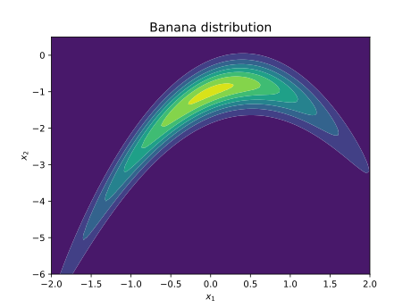

# AE567 Project 2 Part 2: Bayesian Inference for Nonlinear Models

# Akshat Dubey

## 1 Delayed Rejection Adaptive Metropolis

## 1.1 Adaptive Metropolis Hastings

## 1.2 Delayed Rejection

## 1.3 Delayed Rejection Adaptive Metropolis

## 1.4 Target (Banana distribution)

{width=60%}

## 1.5 Results

### 1.5.a Plots of 1D and 2D marginals

{width=80%}

{width=80%}

{width=80%}

{width=80%}

### 1.5.b Autocorrelation plots

### 1.5.c Integrated autocorrelation values

Integrated autocorrelation values:

- Metropolis Hastings: [53.73513467 90.92565703]
- Adaptive Metropolis: [13.37771915 36.23410877]
- Delayed Rejection: [53.70883528 51.10493089]
- Delayed Rejection Adaptive Metropolis: [ 2.39355737 10.16193247]

### 1.5.d Acceptance ratio

Acceptance ratio:

- Metropolis Hastings: 42%
- Adaptive Metropolis: 12%
- Delayed Rejection: 45%
- Delayed Rejection Adaptive Metropolis: 30%

### 1.5.e Visual inspection of mixing

