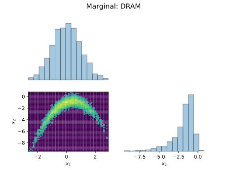

# AE567 Project 2 Part 2: Bayesian Inference for Nonlinear Models

# Akshat Dubey

## 1 Delayed Rejection Adaptive Metropolis on the Banana Distribution

First lets take a look a the target distribution that we would like to sample from, which is the banana distribution. In our case the distribution is defined as

$$
(x_1, x_2 + (x_1^2 + 1)) \sim \mathcal{N}(
	\begin{bmatrix}
    0 \\
    0
\end{bmatrix}
, \begin{bmatrix}
   1 & 0.9 \\
	 0.9 & 1
\end{bmatrix}
)
$$

{width=60%}

Since for all of our use cases, we will be using the log PDF of the distribution, we need to derive it. For a standard multivariate gaussian ($x \sim \mathcal{N}(x|\mu, \Sigma)$), the PDF is given by (ref: [wikipedia](https://en.wikipedia.org/wiki/Multivariate_normal_distribution))

Let

$$
\begin{aligned}
d & \text{: dimension of } x \\
\mu & \text{: mean of } x \\
\Sigma & \text{: covariance matrix of } x \\
|\Sigma| & \text{: determinant of } \Sigma \\
\end{aligned}
$$

Then,

$$
f_X(x) = \frac{\exp\left(-\frac{1}{2}(x-\mu)^T\Sigma^{-1}(x-\mu)\right)}{\sqrt{(2\pi)^d|\Sigma|}} \\
$$

Hence the logPDF is given by

$$
log(f_X) = - \frac{(x-\mu)^T\Sigma^{-1}(x-\mu)}{2} - \frac{d . ln(2\pi)}{2} - \frac{ln|\Sigma|}{2}
$$

substituting the values of $\mu$, $\Sigma$ for the banana distribution

$$
log(f_X) = -\frac{1}{2} x^T \begin{bmatrix} 1 & 0.9 \\ 0.9 & 1 \end{bmatrix}^{-1} x - ln(2\pi) - \frac{ln(0.19)}{2}
$$

Everything here except for $x^T$ and $x$ is a constant, hence we can precompute and store them to improve computational efficiency.

We can take any inputs $(x_1,x_2)$, transform them to $(x_1, x_2 + (x_1^2 + 1))$ and then plug that into the logPDF to get the logPDF of the banana distribution.

Before we move on to Delayed Rejection Adaptive Metropolis(DRAM), lets first set a baseline by implementing the standard Metropolis Hastings(MH) Markov Chain Monte Carlo(MCMC) algorithm. The Metropolis Hastings algorithm is a simple MCMC algorithm that generates a Markov chain that should converge to the banana distribution. The algorithm is as follows:

Let

$$
\begin{aligned}
q(y|x) & \text{: proposal distribution that proposes} \ y \ \text{given} \ x \\
f_{Xb}(x) & \text{: logPDF of x in the banana distribution} \\
f_{Xq}(x|y) & \text{: logPDF of x given y in the proposal distribution} \\
N & \text{: Number of samples requested from the Markov Chain}
\end{aligned}
$$

1. Set initial state $x^{(0)}$ and proposal distribution $q(y|x^{(k)})$
2. For k = 1 to N:
   1. Generate a proposal $y \sim q(y|x^{(k)})$
   2. Calculate the acceptance ratio $a_1(x^{(k)}, y) = min(1, \exp(f_{Xb}(y) - f_{Xb}(x^{(k)}) + f_{Xq}(x^{(k)}|y) - f_{Xq}(y|x^{(k)}))$)
   3. Set $x^{(k+1)}$ as follows:
      $$
      x^{(k+1)} = \left\{ \begin{array}{ll}
      				y & \mbox{with probability $a_1$}\\
      				x^{(k)} & \mbox{otherwise}\end{array} \right..
      $$
   4. Increment $k$
3. Return the samples $x^{(1)}, x^{(2)}, \ldots, x^{(N)}$ as the Markov chain

Note that since we are using a random walk proposal, the probability of proposing $y$ given $x^{(k)}$ is the same as the probability of proposing $x^{(k)}$ given $y$, hence, the terms $f_{Xq}(x^{(k)}|y)$ and $f_{Xq}(y|x^{(k)})$ cancel out in the acceptance ratio. and the acceptance ratio simplifies to $a_1(x,y) = min(1, \exp(f_{Xb}(y) - f_{Xb}(x^{(k)}))$. Since we will be using the same proposal distribution for all iterations, we can ignore the proposal distribution terms in the acceptance ratio $a_1$ from now on.

To get started with the Metropolis Hastings algorithm, we need to find a way to get the initial state and a proposal distribution as needed in step 1. To get the initial state, we can start off from the Maximum Aposteriori(MAP) estimate of the banana distribution. The MAP estimate can be found by maximizing the logPDF of the banana distribution. If we simplify the problem and approximate the distribution as a 2D gaussian, the scaled negative inverse of the hessian at the MAP point can be used as the covariance matrix for a random walk proposal. This is also called the Laplace Approximation. The scaling factor of the negative inverse hessian is important for determining the covariance of the the random walk proposal and has been taken from the suggestion in the notes (ref: eq 16.6). Specifically:

$$
\begin{aligned}
x_{MAP} &= \arg\max_x f_{Xb}(x) \\
\Sigma_{proposal} &= -\frac{2.4^2}{d}\left(\nabla^2 f_{Xb}(x_{MAP})\right)^{-1} \\
x^{(0)} &= x_{MAP} \\
q(y|x) &= \mathcal{N}(y|x, \Sigma_{proposal})
\end{aligned}
$$

Hence for the random walk proposal, we can sample it using the Cholesky decomposition of the covariance matrix $\Sigma_{proposal}$ and adding it to the current state $x^{(k)}$ (ref: notes section 6.2) just like project 2.a. We can also calculate its logPDF the same way we did for the banana distribution without transforming the inputs $(x_1, x_2)$ to $(x_1, x_2 + (x_1^2 + 1))$.

Using `scipy.optimize.minimize` with $-f_{Xb}$ as the objective function, we find the MAP and proposal covariance matrix:

- $x_{MAP}$: (-9.44e-08, -1)
- $$
  \begin{aligned}
  & \Sigma_{proposal} :
  \begin{bmatrix}
  2.88 & 2.59 \\
  2.59 & 2.88
  \end{bmatrix}
  \end{aligned}
  $$

Having established a baseline of MH with a starting $x^{(0)}$ and a proposal distribution $q(y|x)$, we can now move on to other MCMC algorithms.

## 1.1 Adaptive Metropolis

The Adaptive Metropolis (AM) algorithm consists of the same basic steps as the MH algorithm, but instead of using the same proposal distribution for all iterations, it adapts the proposal distribution based on the samples generated so far. Once a specified threshold of iterations has been reached, it starts using the adapted covariance instead of $\Sigma_{proposal}$ The algorithm is as follows:

1. Set initial state $x^{(0)}$ and proposal distribution $q(y|x^{(k)})$
2. For k = 1 to N:
   1. Generate a proposal $y \sim q(y|x^{(k)})$
      - If k $\leq$ threshold, proposal covariance = $\Sigma_{proposal}$
      - Otherwise, proposal covariance = covariance of all samples generated so far
   2. Calculate the acceptance ratio $a_1(x,y) = min(1, \exp(f_{Xb}(y) - f_{Xb}(x^{(k)})))$
   3. Set $x^{(k+1)}$ as follows:
      $$
      x^{(k+1)} = \left\{ \begin{array}{ll}
      				y & \mbox{with probability $a_1$}\\
      x^{(k)} & \mbox{otherwise}\end{array} \right..
      $$
   4. **Update the proposal distribution $q(y|x^{(k)})$ based on the samples generated so far**
   5. Increment $k$

Notice that the only additional step here compared to MH is step 4, where the proposal distribution is updated based on the samples generated so far. The proposal distribution is updated by taking the empirical covariance of the samples generated so far and using it as the covariance matrix of the proposal distribution. When generating a lot of samples, taking the empirical covariance of all the previous samples is computationally expensive and actually wasteful since we perform redundant calculations that we have already done in previous iterations. Hence the covariance was updated recursively using the sample mean which was also updated recursively. The recursive update of the mean and covariance is as follows(ref: eq 16.9 and 16.10 from notes):

$$
\begin{aligned}
\text{Let} & \\
\bar{x}^{(k)} & \text{: mean of all samples up to } k \\
S^{(k)} & \text{: covariance of all samples up to } k \\
s_d = \frac{2.4^2}{d} & \text{: scaling factor for proposal covariance} \\
\xi = 1e-7 & \text{: constant to keep the covariance matrix well-conditioned} \\
\bar{x}^{(k)} &= \frac{1}{k+1}x^{(k)} + \frac{k}{k+1}\bar{x}^{(k-1)} \\
S^{(k+1)} &= \frac{k-1}{k}S^{(k)} + \frac{s_d}{k} (\xi I + k\bar{x}^{(k-1)}\bar{x}^{(k-1)^T} - (k+1)\bar{x}^{(k)}\bar{x}^{(k)^T} + x^{(k)}x^{(k)^T})
\end{aligned}
$$

We can start off this process with

$$
\begin{aligned}
\bar{x}^{(0)} &= x^{(0)} \\
S^{(0)} &= \Sigma_{proposal}
\end{aligned}
$$

This way, we can adapt the proposal distribution based on the samples generated so far, so that $q(y|x^{(k)}) \sim \mathcal{N}(x^{(k)}, S^{(k)})$ and hopefully get the acceptance ratio closer to 20%-30% and samples closer to the banana distribution. Take note that the scaling factor $s_d$ need not be the same as defined above and can be used as a tuning knob to adjust the acceptance ratio. Increasing it will cause the proposal distribution to be more exploratory, reducing the acceptance ratio and vice versa. It may seem that the adaptation threshold is also a tuning knob, but I did not explore it in this project because setting it too high did not make sense to me as we want to adapt as soon as possible. I reject the first half of the samples generated anyway, so even if the initial samples have a bad estimate of the actual covariance, they will not be taken into account. In addition, the covariance matrix is updated every iteration instead of at a set frequency so that it can stay as close to the true covariance as possible unlike in the notebook we discussed in class.

## 1.2 Delayed Rejection

The Delayed Rectection (DR) algorithm is a variant of the MH algorithm that tries to improve the acceptance ratio by using multiple proposals in a single iteration. For this project we will only use one secondary proposal which will use the covariance matrix of the first proposal scaled by a constant $\gamma$. To preserve the reversibility of the markov chain, the acceptance ratio $a_2$ is calculated differently from $a_1$. In addition, the second proposal $y_2$ will only depend on the current state $x^{(k)}$ and not on the rejected initial proposal $y_1$, simplifying the calculation of the acceptance ratio.

The acceptance ratio $a_2$ is calculated as follows:

Let

$$
\begin{aligned}
y_1 & \text{: first proposal sample} \\
y_2 & \text{: second proposal sample} \\
\gamma & \text{: scaling factor for the second proposal covariance} \\
q_1(y_1|x^{(k)}) = \mathcal{N}(y_1|x^{(k)}, \Sigma_{proposal}) & \text{: first proposal distribution} \\
q_2(y_2|x^{(k)}) = \mathcal{N}(y_2|x^{(k)}, \gamma \Sigma_{proposal}) & \text{: second proposal distribution} \\
f_{Xq_1}(x|y) & \text{: logPDF of x given y in the first proposal distribution} \\
f_{Xq_2}(x|y) & \text{: logPDF of x given y in the second proposal distribution} \\
\end{aligned}
$$

Then

$$
\begin{aligned}
a_2(x^{(k)},y_1,y_2) &= min(1, \exp(f_{Xb}(y_2) - f_{Xb}(x^{(k)}) + f_{Xq_1}(y_1|y_2) - f_{Xq_1}(y_1|x^{(k)}) \\
 &+ f_{Xq_2}(x|y_2,y_1) - f_{Xq_2}(y_2|y_1,x^{(k)}) + log(1-a_1(y_2,y_1)) - log(1-a_1(x^{(k)},y_1)))
\end{aligned}
$$

Since our second proposal only depends on $x^{(k)}$

$$
\begin{aligned}
a_2(x^{(k)},y_1,y_2) &= min(1, \exp(f_{Xb}(y_2) - f_{Xb}(x^{(k)}) + f_{Xq_1}(y_1|y_2) - f_{Xq_1}(y_1|x^{(k)}) \\
 &+ f_{Xq_2}(x|y_2) - f_{Xq_2}(y_2|x^{(k)}) + log(1-a_1(y_2,y_1)) - log(1-a_1(x^{(k)},y_1)))
\end{aligned}
$$

Since the proposal $q_2$ is symmetric, $f_{Xq_2}(x^{(k)}|y_2) = f_{Xq_2}(y_2|x^{(k)})$, so they cancel out.

$$
\begin{aligned}
a_2(x^{(k)},y_1,y_2) &= min(1, \exp(f_{Xb}(y_2) - f_{Xb}(x^{(k)}) + f_{Xq_1}(y_1|y_2) - f_{Xq_1}(y_1|x^{(k)}) + log(1-a_1(y_2,y_1)) - log(1-a_1(x^{(k)},y_1)))
\end{aligned}
$$

The algorithm is as follows:

1. Set initial state $x^{(0)}$ and proposal distribution $q_1(y|x^{(k)})$
2. For k = 1 to N:

   1. Generate a proposal $y_1 \sim q_1(y_1|x^{(k)})$
   2. Calculate the acceptance ratio $a_1(x^{(k)},y) = min(1, \exp(f_{Xb}(y) - f_{Xb}(x^{(k)})))$
   3. Accept $x^{(k+1)} = y_1$ with probability $a_1$

   - If accepted, skip to step 4
   - if rejected:

     1. Generate a second proposal $y_2 \sim q_2(y_2|x^{(k)})$
     2. Calculate the acceptance ratio $a_2(x^{(k)},y_1,y_2)$ using the formula above
     3. Set $x^{(k+1)}$ as follows:
        $$
        x^{(k+1)} = \left\{ \begin{array}{ll}
        				y_2 & \mbox{with probability $a_2$}\\
        				x^{(k)} & \mbox{otherwise}\end{array} \right..
        $$

   4. Increment $k$

Here the only tuning knob we have is $\gamma$, which can be used to adjust the acceptance ratio. Increasing it will cause the proposal distribution to be more exploratory, reducing the acceptance ratio and vice versa. Since it is used when the first proposal is too exploratory and rejected, it should be $\leq$ 1 to ensure that the second proposal is less exploratory and gets accepted.

## 1.3 Delayed Rejection Adaptive Metropolis

The Delayed Rejection Adaptive Metropolis (DRAM) algorithm is a combination of the AM and DR algorithms. It adapts the proposal distribution based on the samples generated so far and uses 2 levels of proposals in each iteration. Take note after the adaptation threshold is reached, the second proposal scales the estimated covariance of the samples so far and not $\Sigma_{proposal}$ The algorithm is as follows:

1. Set initial state $x^{(0)}$ and proposal distribution $q_1(y|x^{(k)})$
2. For k = 1 to N:

   1. Generate a proposal $y_1 \sim q_1(y_1|x^{(k)})$
      - If k $\leq$ threshold, proposal covariance = $\Sigma_{proposal}$
      - Otherwise, proposal covariance = covariance of all samples generated so far
   2. Calculate the acceptance ratio $a_1(x^{(k)},y) = min(1, \exp(f_{Xb}(y) - f_{Xb}(x^{(k)})))$
   3. Accept $x^{(k+1)} = y_1$ with probability $a_1$

   - If accepted, skip to step 4
   - if rejected:

     1. Generate a second proposal $y_2 \sim q_2(y_2|x^{(k)})$ by scaling the covariance matrix of the first proposal by a constant $\gamma$ like in DR
     2. Calculate the acceptance ratio $a_2(x^{(k)},y_1,y_2)$ using the formula in DR
     3. Set $x^{(k+1)}$ as follows:
        $$
        x^{(k+1)} = \left\{ \begin{array}{ll}
        				y_2 & \mbox{with probability $a_2$}\\
        				x^{(k)} & \mbox{otherwise}\end{array} \right..
        $$

   4. Update the proposal distribution $q_1(y|x^{(k)})$ based on the samples generated so far using the formula in AM
   5. Increment $k$

Here we have 2 tuning knobs, $\gamma$ and $s_d$, which can be used to adjust the acceptance ratio. Increasing $\gamma$ will cause the proposal distribution to be more exploratory, reducing the acceptance ratio and vice versa. Increasing $s_d$ will cause the proposal distribution to be more exploratory, reducing the acceptance ratio and vice versa. Since $\gamma$ is used when the first proposal is too exploratory and rejected, it should be $\leq$ 1 to ensure that the second proposal is less exploratory and gets accepted. Again, even though it is available, i have not used the adaptation threshold as a tuning for the same reasons described in the AM section.

## 1.4 Banana Distribution (Already covered in section 1)

$\pagebreak$

## 1.5 Results

N = 50000 samples were generated for each algorithm, out of which 50% were discarded and the remaining 50% were downsampled by another 50%, resulting in 12500 samples after burn-in. For the entire results section, all algorithms except MH have been tuned to result in an acceptance ratio of around 20%-30% while still maintaining good autocorrelation, marginals and looking good under visual inspection.

### 1.5.a Plots of 1D and 2D marginals

{width=61%}

{width=61%}

The standard MH Algorithm was pretty inconsistent across runs, and I have displayed two runs of the same code but with different seeds for `np.random` and the results vary quite a bit. For the rest of the report, I am taking the worst case run of the MH algorithm so it is easier to see the benefits of the other algorithms over it. This inconsistency was not observed in the other algorithms, which prove why they are better than the standard MH algorithm.

{width=80%}

{width=80%}

{width=80%}

Here we expect the join distribution to look like the target banana distribution, and the marginals to represent the individual dimensions. Looking at the distributions, we can see that DRAM performs the best and MH performs the worst in terms of matching the original banana distribution. However, DRAM, AM and DR all have a similar performance in terms of matching the banana distribution and look pretty good.

$\pagebreak$

### 1.5.b/1.5.c Autocorrelation plots and Integrated autocorrelation values

Autocorrelation represents the correlation between the samples at different $k$ values, which are represented as lags. In an ideal Markov Chain, the samples should be uncorrelated except for with the previous sample since it is used to generate it. Realistically, is is impossible for the autocorrelation to drop to 0 after a lag of 1, so we expect the better performing algorithms to have very little autocorrelation beyond a small lag value.

The autocorrelation plots are plotted to a lag where the autocorrelation first reaches 0 for the worst algorithm. This is done to keep the x axis the same for easier comparison. We can observe that MH performs the worst as expected, and DRAM performs the best. Again, as we saw with the marginal plots, DRAM, AM and DR have similar performance in terms of autocorrelation. It is interesting to see that DR performs a lot worse in the $x_2$ dimension compared to $x_1$, which makes sense since the banana distribution resembles a gaussian less in the $x_2$ dimension. Since DR is not able to adapt its proposal distribution, it is not able to sample from the distribution in $x_2$ as well as the adaptive algorithms.

The Integrated Autocorrelation(IAC) values are calculated by summing the autocorrelation values for each axis up to a certain lag where the autocorrelation reaches 0. This is done to get an idea of how much total autocorrelation was present in the samples generated by each algorithm. The lower the IAC, the better the algorithm. Just like the autocorrelation plots, these values have been calculated to the lag where the autocorrelation first reaches 0 for the worst algorithm to have a fair comparison.

Integrated autocorrelation values for each axis:

- MH: [279.31530273 496.92620102]
- AM: [40.49130493 24.24136262]
- DR: [25.38595114 35.05717595]
- DRAM: [ 6.52753247 10.75545756]

Here, the difference between the algorithms is clearer. We can see that MH performs the worst by a huge margin, and DRAM performs the best, followed by AM and DR. An interesting artefact of using the same lag value to calculate the IAC is that for the better performing algorithms, the IAC actually has a lot of noise as can be seen in the Autocorrelation plots after the Autocorrelation reaches 0 for them. This might cause the IAC to be higher than it actually is. This happens because the better performing algorithms have a very small IAC to begin with and adding even a little noise inflates their score significantly. However it is still a good metric to compare the algorithms.

$\pagebreak$

### 1.5.d Acceptance ratio

Acceptance ratio is the percentage of proposed samples that were accepted while running the algorithm. A good acceptance ratio is around 20%-30% as per the notebook we went through in class. A lower acceptance ratio means that the proposal distribution is too exploratory and the samples are being rejected too often. A higher acceptance ratio means that the proposal distribution is not exploratory enough and the samples are being accepted too often, which might cause the algorithm to get stuck in a small local area.

Acceptance ratios without tuning:

- MH: 22%
- AM: 14%
  - $s_d$: 2.88
- DR: 41%
  - $\gamma$: 0.5
- DRAM: 28%
  - $\gamma$: 0.5
  - $s_d$: 2.88

Acceptance ratios with tuning:

- MH: 22%
- AM: 26%
  - $s_d$: 0.9
- DR: 31%
  - $\gamma$: 2
- DRAM: 25%
  - $\gamma$: 0.7
  - $s_d$: 2.88

While tuning DR, I noticed that if i tried to push the acceptance ratio down by increasing $\gamma$ beyond 2, the autocorrelation would become a lot worse, causing a much slower dropoff in autocorrelation and a higher IAC. Increasing $\gamma$ beyond 1 was done just to explore its effects, knowing that it is not intended to be used like this. according Hence, for the sake of experimentation, I decided to keep it at 2 since it was giving a better result than when it was $\leq$ 1. For AM, I tried to push the acceptance ratio up by decreasing $s_d$, which worked as expected without significantly impacting the rest of the metrics. For DRAM, the acceptance ratio was already pretty good, so I only made a small adjustment to $\gamma$ to get it to 25%.

$\pagebreak$

### 1.5.e Visual inspection of mixing

{width=81%}

This visual inspection helps to see how truly random and uncorrelated the samples from each algorithm are. Here we expect to see a random distribution of points that are not correlated with each other. This means we should not see any trends in the samples. If we see that the samples are forming a pattern near a particular value, it indicates that the MC is stuck in a local area and is not sampling the whole distribution. As seen in previous metrics, we can see that DRAM performs the best, followed by AM and DR. MH performs the worst, as expected. MH has a lot of correlated samples near sample number 3500 and 7500, which is bad. DR also has some samples clumped together near sample number 4500, 7000 and 11000, but they do not stay together nearly as much as MH. AM also has three such clusters, near sample number 3500, 6500 and 11000, but they do not stay clustered together as much as DR. DRAM has the least amount of clustering, with only one small cluster near sample number 3800, which is not as bad as the other algorithms. Hence we can see that DRAM is performing the best.

$$
$$
