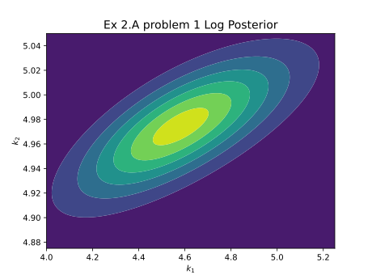

## 2 Apply DRAM for Bayesian Inference

## 2.A Satellite Dynamics

After setting up the Satellite Dynamics, we can observe the true trajectory of the satellite and the noisy trajectory observed by the sensor data.

{height=73%}

## Problem 1: Parameters are the control coefficients (k1, k2)

### 1 What is the likelihood model? Please describe how you determine this.

For this exercise, the likelihood model will tell us how likely/probable the observed sensor data is given the parameters of the model $(k_1, k_2)$. We only have access to a subset of all data $(q_1, q_2, q_3)$ that the satellite generates, so we will focus on just the data that is available. Given a function $f(\theta,t)$ that propagates the trajectory of the satellite using the parameters $\theta = (k_1,k_2)$ and outputs the quaternions $(q_1^{(t)}, q_2^{(t)}, q_3^{(t)})$ at any given time $t$,

Let

$$
\begin{aligned}
\text{params: }\theta &= (k_1,k_2) \\
\text{time instances: } t &= 1,2,...,50 \\
\text{trajectory function: } f(\theta, t) &= \begin{bmatrix} q_1^{(t)} \\ q_2^{(t)} \\ q_3^{(t)} \end{bmatrix} \\
\end{aligned}
$$

We have already observed the sensor data $y^{(t)}$ for the true satellite trajectory at each time instance $t$.

$$
\text{actual sensor data at time t: } y^{(t)} = \begin{bmatrix} y_1^{(t)} \\ y_2^{(t)} \\ y_3^{(t)} \end{bmatrix} \\
$$

Hence, the likelihood can be written as:

$$
\text{Likelihood: } \mathcal{L}(\theta) = \mathbb{P}(y|\theta)
$$

The sensor captures quaternion data ($q_1,q_2,q_3$) corrupted by independent Gaussian noise with 0 mean and standard deviation of 0.05. This means the data captured by the sensor of the actual satellite trajectory is not deterministic, but stochastic and follows a probability distribution. The meaning of $\mathbb{P}(y|\theta)$ is that we will be comparing the sensor data $y^{(t)}$ with the trajectory output $q^{(t)}$ by the function $f(\theta,t)$ at each time instance $t$.

$$
\begin{aligned}
\text{sensor noise: } \xi &\sim \mathcal{N}(0, 0.05^2) \\
\text{distribution of sensor data at time t: } s^{(t)} &= \begin{bmatrix} q_1^{(t)} + \xi \\ q_2^{(t)} + \xi \\ q_3^{(t)} + \xi \end{bmatrix}
\end{aligned}
$$

$s^{(t)}$ is a multivariate gaussian distribution with mean $q^{(t)}$ and covariance matrix $0.05^2 I$. This is because the noise is independent and identically distributed for each quaternion component.

$$
\begin{aligned}
\text{dimensions: } d &= 3 \\
\text{covariance matrix: } \Sigma &= 0.05^2 I = \begin{bmatrix} 0.05^2 & 0 & 0 \\ 0 & 0.05^2 & 0 \\ 0 & 0 & 0.05^2 \end{bmatrix} \\
s^{(t)} &= \mathcal{N}(q^{(t)}, \Sigma) \\
\end{aligned}
$$

Now we know that the likelihood for a certain sensor measurement of the quaternions is determined by how far away it is from the quaternions of the trajectory propagated by certain $\theta$, taking into account the noise of the sensor. Different parameters will result in different trajectories, and the sensor data might be closer to some trajectories than others. The likelihood then is the probability of the observed sensor data given a trajectory mapped by the chosen parameters. In other words, we are trying to see how probable/likely the data captured by the sensor is given its noise, if a certain trajectory was mapped by the chosen parameters. The trajectory determined by the parameters is in continuous time, while the sensor data is in discrete time. We need to select the quaternions of the trajectory at the same time instances as the sensor data. The probability of $y^{(t)}$ given $\theta$ is then the probability of a multivariate gaussian distribution with mean $q^{(t)}$ (output of the function $f(\theta,t)$) and covariance matrix $0.05^2 I$ at $y^{(t)}$. The likelihood is then the product of the probabilities of the $y^{(t)}$ given $s^{(t)}$ at each time instance $t$.

$$
\text{Likelihood: } \mathcal{L}(\theta) = \prod_{t=1}^{50} \mathbb{P}(y^{(t)} | s^{(t)})
$$

For ease of computation, we will actually use the log-likelihood.

$$
\text{Log-Likelihood: } \log \mathcal{L}(\theta) = \sum_{t=1}^{50} \log \mathbb{P}(y^{(t)} | s^{(t)}) \\
$$

Since the noise is a multivariate gaussian, we can easily use log probability of a multivariate gaussian to compute this value.

Let

$$
\begin{aligned}
\text{determinant of covariance matrix: } & |\Sigma| \\
\end{aligned}
$$

Then

$$
\begin{aligned}
\log \mathbb{P}(y^{(t)} | s^{(t)}) &= \log \mathcal{N}(y^{(t)} | q^{(t)}, \Sigma) \\
&= \log \left( \frac{\exp \left( -\frac{1}{2} (y^{(t)} - q^{(t)})^T \Sigma^{-1} (y^{(t)} - q^{(t)}) \right)}{\sqrt{(2\pi)^d |\Sigma|}} \right) \\
&= -\frac{d}{2} \log(2\pi) - \frac{1}{2} \log(|\Sigma|) - \frac{1}{2} (y^{(t)} - q^{(t)})^T \Sigma^{-1} (y^{(t)} - q^{(t)}) \\
&= -\frac{1}{2} \left( d \log(2\pi) + \log(|\Sigma|) + (y^{(t)} - q^{(t)})^T \Sigma^{-1} (y^{(t)} - q^{(t)}) \right) \\
\end{aligned}
$$

**Note:** If the matrices $y$ and $q$ contain all the quaternions for all time instances,

$$
\begin{aligned}
y &= \begin{bmatrix} y_1^{(1)} & y_1^{(2)} & ... & y_1^{(50)} \\ y_2^{(1)} & y_2^{(2)} & ... & y_2^{(50)} \\ y_3^{(1)} & y_3^{(2)} & ... & y_3^{(50)} \end{bmatrix} \\
q &= \begin{bmatrix} q_1^{(1)} & q_1^{(2)} & ... & q_1^{(50)} \\ q_2^{(1)} & q_2^{(2)} & ... & q_2^{(50)} \\ q_3^{(1)} & q_3^{(2)} & ... & q_3^{(50)} \end{bmatrix} \\
\end{aligned}
$$

And the difference $y - q$ is computed element-wise, the log likelihood can be computed in a vectorized form which is explored in the `multigauss_logpdf` function in the code giving a ~1000x speedup over `scipy.stats.multivariate_normal.logpdf` and 10x over `lognormpdf`.

### 2 What is the form of the posterior?

In Bayesian inference, the posterior is the probability of the parameters($\theta$) given the observed data($y$). It is proportional to the likelihood of the data given the parameters and the prior probability of the parameters.

$$
\mathbb{P}(\theta | y) = \frac{\mathbb{P}(\theta) \mathbb{P}(y | \theta)}{\mathbb{P}(y)} \\
$$

Where

$$
\begin{aligned}
\mathbb{P}(\theta) &= \text{Prior probability of the parameters} \\
\mathbb{P}(y | \theta) &= \text{Likelihood of the data given the parameters} \\
\mathbb{P}(y) &= \text{Marginal likelihood of the data} \\
\mathbb{P}(\theta | y) &= \text{Posterior probability of the parameters given the data} \\
\end{aligned}
$$

The posterior is basically the prediction of our parameters $\theta = (k_1,k_2)$ using our prior belief about $k_1,k_2$ (Prior), how probable the data $y$ is given a trajectory propagated by the parameters $k_1,k_2$ (Likelihood) and the probability of the data $y$ itself(Marginal Likelihood). The Prior for each $\theta_i$ is given in the problem statement to be $\theta_i \sim \mathcal{N}(0, 1)$, so we can both sample from it and determine the probability density. The Likelihood can be computed as described in the previous section. The Marginal Likelihood is the probability of the data $y$ given the model of the satellite, which is the integral of their probability over all possible parameters $k_1,k_2$. Since the space of parameters is unbounded unsolvable analytically, this integral is intractable. This is why we use MCMC methods to sample from the posterior distribution directly, because it is able to sample from a distribution that cannot be be evaluated up to their normalizing constant, which is the marginal likelihood of the data in this case.

In this way, we can compute the posterior and log posterior distribution by:

$$
\begin{aligned}
\text{Posterior: } \mathbb{P}(\theta | y) &: \mathbb{P}(\theta) \mathbb{P}(y | \theta) \\
\text{Log Posterior: } \log \mathbb{P}(\theta | y) &: \log \mathbb{P}(\theta) + \log \mathbb{P}(y | \theta) \\
\end{aligned}
$$

Here both the probabilities are multivariate gaussian and can be calculated in the same way as described in the previous section.

Since this problem has a 2-dimensional parameter space, we can visualize the posterior distribution as a 2D plot

{width=80%}

### 3 How did you tune your proposal? Think carefully about what a good initial point and initial covariance could be?

The proposal used for the DRAM is a gaussian random walk proposal. For the initial point we can start off from the Maximum Aposteriori(MAP) estimate of the posterior distribution. This will be a certain value of $\theta=(k_1,k_2)$. The MAP estimate can be found by maximizing the logPDF of the posterior distribution. If we simplify the problem and approximate the posterior as a 2D gaussian, the scaled negative inverse of the hessian at the MAP can be used as the covariance matrix for a random walk proposal. This is also called the Laplace Approximation. The scaling factor of the negative inverse hessian is important for determining the initial covariance of the the random walk proposal and has been taken from the suggestion in the notes (ref: eq 16.6). Specifically:

Let

$$
\text{Log Posterior: } \log \mathbb{P}(\theta | y) = f_{Xpost}
$$

Then

$$
\begin{aligned}
\theta_{MAP} &= \arg\max_x f_{Xpost} \\
\theta^{(0)} &= \theta_{MAP} \\
\Sigma_{proposal}^{(0)} &= -\frac{2.4^2}{d}\left(\nabla^2 f_{Xpost}(\theta_{MAP})\right)^{-1} \\
\end{aligned}
$$

Using `scipy.optimize.minimize` with $-f_{Xpost}$ as the objective function, we find the MAP and initial proposal covariance matrix:

- $\theta^{(0)} = (k_1,k_2)$: (4.58036977, 4.9741691)
- $$
  \begin{aligned}
  & \Sigma_{proposal}^{(0)} :
  \begin{bmatrix}
  7.94e-4 & 9.99e-5 \\
  9.99e-5 & 8.45e-4
  \end{bmatrix}
  \end{aligned}
  $$

After the initial $\theta^{(0)}=(k_1^{(0)},k_2^{(0)})$ and $\Sigma_{proposal}^{(0)}$ are determined, the proposal is tuned by adjusting $\gamma$ and $s_d$ in the DRAM algorithm as described in part 1 of this project. The covariance of the accepted samples is updated at each iteration and scaled by $s_d$ to get the covariance matrix of the first proposal, and if the first proposal is rejected, the covariance matrix is scaled further by $\gamma$ for the second proposal.

Since the ideal acceptance ratio is 20-30%, I try to change $s_d$ and $\gamma$ to get an acceptance ratio in this range. While doing this, I also monitor the Marginals, Autocorrelation vs lag plot, the Integrated Autocorrelation(IAC) and the visual inspection of the samples to ensure that the samples are mixing well and the proposal is tuned correctly. Specifically

- Acceptance ratio:
  - if low, decrease $s_d$ and $\gamma$
  - if high, increase $s_d$ and $\gamma$
- Marginals:
  - if clustering around a few points and not exploring enough, increase $s_d$ and $\gamma$
- Autocorrelation:
  - if doesnt decay quickly, increase $s_d$ and $\gamma$
- IAC:
  - if high, increase $s_d$ and $\gamma$

For the sake of speed, to increase the acceptance ratio I preferred to decrease $s_d$ before I increased $\gamma$, because if the first proposal is rejected, the trajectory has to be propagated again for the second proposal, which is computationally expensive. Hence I prefered the first proposal to be accepted more often rather than it rejecting and the 2nd proposal being accepted. In fact, I experimented with increasing $\gamma$ as high as 100, but it has minimal impact on the acceptance ratio, so I kept it low and preferred to tune $s_d$ instead. This makes sense given that increasing $s_d$ will also increase the scale for the second proposal as a side effect, thus affecting both proposals and having a larger impact. $\gamma$ is meant to be used when the first proposal rejected for being too exploratory, so it should ideally be $\leq$ 1 so the second proposal is more conservative.

After tuning, I ended up with $s_d=9$ and $\gamma=0.9$ for the final proposal. I started off with a high acceptance ratio, so I increased $s_d$ to get the acceptance ratio in the desired range. I also increased $\gamma_{DRAM}$ slightly. I made sure that all other metrics remained good while this happened.

$\pagebreak$

### 4/5 Analyze your results using the same deliverables as you used in Section 1.

{width=70%}

{width=75%}

$\pagebreak$

{width=80%}

- Integrated autocorrelation values:

  - $k_1$: 1.77
  - $k_2$: 2.4

- Acceptance ratio: 31%

Right off the bat, we can see that the 2-D scatter plot of the posterior matches the plot made in section 2 where we plotted the posterior, so our MCMC has worked well. The acceptance ratio started off very high, but was tuned to 30% while making sure that the samples are mixing well. We can see that the marginals look good, and the Autocorrelation plot decays quickly leading the low values of IAC. Finally, the visual inspection of the samples shows that the samples do not get stuck in a local area and the MC is exploring the parameter space well.

When we compare the value of the true $k_1$ and $k_2$ with the marginals, we can see that the true values are not exactly at the peak of the gaussian marginals. This could be due to there being noise in our data, and the fact that our prior was very far of from the true values. Given these limitation, we cannot expect the posterior to converge exactly to the true values, but we can see that true values are not that far off from the peak of the marginals, which is a good sign.

$\pagebreak$

### 6 Plot the prior and posterior predictives of the dynamics (separately)

The true trajectory is plotted in blue and the predicted trajectory is plotted in gray.

{width=80%}

{width=80%}

While the prior predictive matches the trajectory initially, it soon deviates really far away from the true satellite trajectory. This is expected since we are not using any data to infer our parameters at this stage. The posterior predictive trajectory very closely matches the true satellite trajectory, being almost on top of the true trajectory which is a good sign that our MCMC has worked well and the parameters have been inferred correctly. With these plots, we can clearly see the difference Bayesian inference has made in our predictions.

$\pagebreak$

## Problem 2: Parameters are the control coefficients and a product of inertia (k1, k2, J12)

### 1 What is the likelihood model? Please describe how you determine this.

For this exercise, the likelihood model will tell us how likely/probable the observed sensor data is given the parameters of the model $(k_1,k_2,J_{12})$. We only have access to a subset of all data $(q_1, q_2, q_3)$ that the satellite generates, so we will focus on just the data that is available. Given a function $f(\theta,t)$ that propagates the trajectory of the satellite using the parameters $\theta = (k_1,k_2,J_{12})$ and outputs the quaternions $(q_1^{(t)}, q_2^{(t)}, q_3^{(t)})$ at any given time $t$,

Let

$$
\begin{aligned}
\text{params: }\theta &= (k_1,k_2,J_{12}) \\
\text{time instances: } t &= 1,2,...,50 \\
\text{trajectory function: } f(\theta, t) &= \begin{bmatrix} q_1^{(t)} \\ q_2^{(t)} \\ q_3^{(t)} \end{bmatrix} \\
\end{aligned}
$$

We have already observed the sensor data $y^{(t)}$ for the true satellite trajectory at each time instance $t$.

$$
\text{actual sensor data at time t: } y^{(t)} = \begin{bmatrix} y_1^{(t)} \\ y_2^{(t)} \\ y_3^{(t)} \end{bmatrix} \\
$$

Hence, the likelihood can be written as:

$$
\text{Likelihood: } \mathcal{L}(\theta) = \mathbb{P}(y|\theta)
$$

The sensor captures quaternion data ($q_1,q_2,q_3$) corrupted by independent Gaussian noise with 0 mean and standard deviation of 0.05. This means the data captured by the sensor of the actual satellite trajectory is not deterministic, but stochastic and follows a probability distribution. The meaning of $\mathbb{P}(y|\theta)$ is that we will be comparing the sensor data $y^{(t)}$ with the trajectory output $q^{(t)}$ by the function $f(\theta,t)$ at each time instance $t$.

$$
\begin{aligned}
\text{sensor noise: } \xi &\sim \mathcal{N}(0, 0.05^2) \\
\text{distribution of sensor data at time t: } s^{(t)} &= \begin{bmatrix} q_1^{(t)} + \xi \\ q_2^{(t)} + \xi \\ q_3^{(t)} + \xi \end{bmatrix}
\end{aligned}
$$

$s^{(t)}$ is a multivariate gaussian distribution with mean $q^{(t)}$ and covariance matrix $0.05^2 I$. This is because the noise is independent and identically distributed for each quaternion component.

$$
\begin{aligned}
\text{dimensions: } d &= 3 \\
\text{covariance matrix: } \Sigma &= 0.05^2 I = \begin{bmatrix} 0.05^2 & 0 & 0 \\ 0 & 0.05^2 & 0 \\ 0 & 0 & 0.05^2 \end{bmatrix} \\
s^{(t)} &= \mathcal{N}(q^{(t)}, \Sigma) \\
\end{aligned}
$$

Now we know that the likelihood for a certain sensor measurement of the quaternions is determined by how far away it is from the quaternions of the trajectory propagated by certain $\theta$, taking into account the noise of the sensor. Different parameters will result in different trajectories, and the sensor data might be closer to some trajectories than others. The likelihood then is the probability of the observed sensor data given a trajectory mapped by the chosen parameters. In other words, we are trying to see how probable/likely the data captured by the sensor is given its noise, if a certain trajectory was mapped by the chosen parameters. The trajectory determined by the parameters is in continuous time, while the sensor data is in discrete time. We need to select the quaternions of the trajectory at the same time instances as the sensor data. The probability of $y^{(t)}$ given $\theta$ is then the probability of a multivariate gaussian distribution with mean $q^{(t)}$ (output of the function $f(\theta,t)$) and covariance matrix $0.05^2 I$ at $y^{(t)}$. The likelihood is then the product of the probabilities of the $y^{(t)}$ given $s^{(t)}$ at each time instance $t$.

$$
\text{Likelihood: } \mathcal{L}(\theta) = \prod_{t=1}^{50} \mathbb{P}(y^{(t)} | s^{(t)})
$$

For ease of computation, we will actually use the log-likelihood.

$$
\text{Log-Likelihood: } \log \mathcal{L}(\theta) = \sum_{t=1}^{50} \log \mathbb{P}(y^{(t)} | s^{(t)}) \\
$$

Since the noise is a multivariate gaussian, we can easily use log probability of a multivariate gaussian to compute this value.

Let

$$
\begin{aligned}
\text{determinant of covariance matrix: } & |\Sigma| \\
\end{aligned}
$$

Then

$$
\begin{aligned}
\log \mathbb{P}(y^{(t)} | s^{(t)}) &= \log \mathcal{N}(y^{(t)} | q^{(t)}, \Sigma) \\
&= \log \left( \frac{\exp \left( -\frac{1}{2} (y^{(t)} - q^{(t)})^T \Sigma^{-1} (y^{(t)} - q^{(t)}) \right)}{\sqrt{(2\pi)^d |\Sigma|}} \right) \\
&= -\frac{d}{2} \log(2\pi) - \frac{1}{2} \log(|\Sigma|) - \frac{1}{2} (y^{(t)} - q^{(t)})^T \Sigma^{-1} (y^{(t)} - q^{(t)}) \\
&= -\frac{1}{2} \left( d \log(2\pi) + \log(|\Sigma|) + (y^{(t)} - q^{(t)})^T \Sigma^{-1} (y^{(t)} - q^{(t)}) \right) \\
\end{aligned}
$$

**Note:** If the matrices $y$ and $q$ contain all the quaternions for all time instances,

$$
\begin{aligned}
y &= \begin{bmatrix} y_1^{(1)} & y_1^{(2)} & ... & y_1^{(50)} \\ y_2^{(1)} & y_2^{(2)} & ... & y_2^{(50)} \\ y_3^{(1)} & y_3^{(2)} & ... & y_3^{(50)} \end{bmatrix} \\
q &= \begin{bmatrix} q_1^{(1)} & q_1^{(2)} & ... & q_1^{(50)} \\ q_2^{(1)} & q_2^{(2)} & ... & q_2^{(50)} \\ q_3^{(1)} & q_3^{(2)} & ... & q_3^{(50)} \end{bmatrix} \\
\end{aligned}
$$

And the difference $y - q$ is computed element-wise, the log likelihood can be computed in a vectorized form which is explored in the `multigauss_logpdf` function in the code giving a ~1000x speedup over `scipy.stats.multivariate_normal.logpdf` and 10x over `lognormpdf`.

### 2 What is the form of the posterior?

In Bayesian inference, the posterior is the probability of the parameters($\theta$) given the observed data($y$). It is proportional to the likelihood of the data given the parameters and the prior probability of the parameters.

$$
\mathbb{P}(\theta | y) = \frac{\mathbb{P}(\theta) \mathbb{P}(y | \theta)}{\mathbb{P}(y)} \\
$$

Where

$$
\begin{aligned}
\mathbb{P}(\theta) &= \text{Prior probability of the parameters} \\
\mathbb{P}(y | \theta) &= \text{Likelihood of the data given the parameters} \\
\mathbb{P}(y) &= \text{Marginal likelihood of the data} \\
\mathbb{P}(\theta | y) &= \text{Posterior probability of the parameters given the data} \\
\end{aligned}
$$

The posterior is basically the prediction of our parameters $\theta = (k_1,k_2,J_{12})$ using our prior belief about $k_1,k_2,J_{12}$ (Prior), how probable the data $y$ is given a trajectory propagated by the parameters $k_1,k_2,J_{12}$ (Likelihood) and the probability of the data $y$ itself(Marginal Likelihood). The Prior for each $\theta_i$ is given in the problem statement to be $\theta_i \sim \mathcal{N}(0, 1)$, so we can both sample from it and determine the probability density. The Likelihood can be computed as described in the previous section. The Marginal Likelihood is the probability of the data $y$ given the model of the satellite, which is the integral of their probability over all possible parameters $k_1,k_2,J_{12}$. Since the space of parameters is unbounded unsolvable analytically, this integral is intractable. This is why we use MCMC methods to sample from the posterior distribution directly, because it is able to sample from a distribution that cannot be be evaluated up to their normalizing constant, which is the marginal likelihood of the data in this case.

In this way, we can compute the posterior and log posterior distribution by:

$$
\begin{aligned}
\text{Posterior: } \mathbb{P}(\theta | y) &: \mathbb{P}(\theta) \mathbb{P}(y | \theta) \\
\text{Log Posterior: } \log \mathbb{P}(\theta | y) &: \log \mathbb{P}(\theta) + \log \mathbb{P}(y | \theta) \\
\end{aligned}
$$

Here both the probabilities are multivariate gaussian and can be calculated in the same way as described in the previous section.

### 3 How did you tune your proposal? Think carefully about what a good initial point and initial covariance could be?

The proposal used for the DRAM is a gaussian random walk proposal. For the initial point we can start off from the Maximum Aposteriori(MAP) estimate of the posterior distribution. This will be a certain value of $\theta=(k_1,k_2,J_{12})$. The MAP estimate can be found by maximizing the logPDF of the posterior distribution. If we simplify the problem and approximate the posterior as a 3D gaussian, the scaled negative inverse of the hessian at the MAP can be used as the covariance matrix for a random walk proposal. This is also called the Laplace Approximation. The scaling factor of the negative inverse hessian is important for determining the initial covariance of the the random walk proposal and has been taken from the suggestion in the notes (ref: eq 16.6). Specifically:

Let

$$
\text{Log Posterior: } \log \mathbb{P}(\theta | y) = f_{Xpost}
$$

Then

$$
\begin{aligned}
\theta_{MAP} &= \arg\max_x f_{Xpost} \\
\theta^{(0)} &= \theta_{MAP} \\
\Sigma_{proposal}^{(0)} &= -\frac{2.4^2}{d}\left(\nabla^2 f_{Xpost}(\theta_{MAP})\right)^{-1} \\
\end{aligned}
$$

Using `scipy.optimize.minimize` with $-f_{Xpost}$ as the objective function, we find the MAP and initial proposal covariance matrix:

- $\theta^{(0)}=(k_1,k_2,J_{12})$: (4.55097817, 4.87289835, 1.59590382)
- $$
  \begin{aligned}
  & \Sigma_{proposal}^{(0)} :
  \begin{bmatrix}
  0.416 & 0.047 & -0.041 \\
  0.047 & 0.012 & -0.028 \\
  0.041 & -0.028 & 0.097 \\
  \end{bmatrix}
  \end{aligned}
  $$

After the initial $\theta^{(0)}=(k_1^{(0)},k_2^{(0)},J_{12})$ and $\Sigma_{proposal}^{(0)}$ are determined, the proposal is tuned by adjusting $\gamma$ and $s_d$ in the DRAM algorithm as described in part 1 of this project. The covariance of the accepted samples is updated at each iteration and scaled by $s_d$ to get the covariance matrix of the first proposal, and if the first proposal is rejected, the covariance matrix is scaled further by $\gamma$ for the second proposal.

Since the ideal acceptance ratio is 20-30%, I try to change $s_d$ and $\gamma$ to get an acceptance ratio in this range. While doing this, I also monitor the Marginals, Autocorrelation vs lag plot, the Integrated Autocorrelation(IAC) and the visual inspection of the samples to ensure that the samples are mixing well and the proposal is tuned correctly. Specifically

- Acceptance ratio:
  - if low, decrease $s_d$ and $\gamma$
  - if high, increase $s_d$ and $\gamma$
- Marginals:
  - if clustering around a few points and not exploring enough, increase $s_d$ and $\gamma$
- Autocorrelation:
  - if doesnt decay quickly, increase $s_d$ and $\gamma$
- IAC:
  - if high, increase $s_d$ and $\gamma$

For the sake of speed, to increase the acceptance ratio I preferred to decrease $s_d$ before I increased $\gamma$, because if the first proposal is rejected, the trajectory has to be propagated again for the second proposal, which is computationally expensive. Hence I prefered the first proposal to be accepted more often rather than it rejecting and the 2nd proposal being accepted. In fact, I experimented with increasing $\gamma$ as high as 100, but it has minimal impact on the acceptance ratio, so I kept it low and preferred to tune $s_d$ instead. This makes sense given that increasing $s_d$ will also increase the scale for the second proposal as a side effect, thus affecting both proposals and having a larger impact. $\gamma$ is meant to be used when the first proposal rejected for being too exploratory, so it should ideally be $\leq$ 1 so the second proposal is more conservative.

After tuning, I ended up with $s_d=4$ and $\gamma=0.9$ for the final proposal. I started off with a high acceptance ratio, so I increased $s_d$ to get the acceptance ratio in the desired range. I also increased $\gamma_{DRAM}$ slightly. I made sure that all other metrics remained good while this happened.

$\pagebreak$

### 4/5 Analyze your results using the same deliverables as you used in Section 1.

{width=75%}

{width=75%}

Integrated autocorrelation values:

- Integrated autocorrelation values:

  - $k_1$: 2.07
  - $k_2$: 5.97
  - $J_{12}$: 5.99

- Acceptance ratio: 30%

The acceptance ratio started off quite high, and it was tuned down close to 30% and we can see that the samples are still mixing well. We can see that the marginals look good and smooth, describing gaussian distributions, and the Autocorrelation plot decays quickly leading the low values of IAC. Finally, the visual inspection of the samples shows that the samples do not get stuck in a local area and the MC is exploring the parameter space well.

When we compare the value of the true $k_1$, $k_2$ and $J_{12}$ with the marginals, we can see that the true values are not exactly at the peak of the gaussian marginals. This could be due to there being noise in our data, which is significant for $J_{12}$, and the fact that our prior for $k_1$ and $k_2$ was very far of from the true values. Given these limitation, we cannot expect the posterior to converge exactly to the true values, but we can see that true values are not that far off from the peak of the marginals, which is a good sign.

$\pagebreak$

### 6 Plot the prior and posterior predictives of the dynamics (separately)

The true data is in blue and the predicted data is in grey

{width=80%}

{width=80%}

The prior predictive looks totally random, only being close to the true trajectory in the beginning while the posterior predictive actually matches the true trajectory of the satellite quite closely. This is a good sign that our model is working well and the parameters are being inferred correctly. The difference between the prior and posterior predictives is quite stark, showing the power of Bayesian inference given that after learning the parameters we can make much better predictions.

$\pagebreak$

## Please comment on the following:

- What is the difference between the two parameter inference problems?

The difference is that in the first problem, we were just trying to infer the control parameters, while in the second problem, the dynamics of the satellite that are described by the product of inertia is also unknown. This makes it a more difficult problem, since the dynamics of the satellite are also unknown and have to be inferred. If the satellite was inherently stable, with known dynamics it might still end up near the true trajectory, but in problem 2, the dynamics are also unknown and can lead to huge deviations from the true trajectory.

- How does the posterior predictive change? - Are there any notable differences?

The posterior predictive changes slightly between the 2 problems, where in problem 1 it very closely matches the true trajectory during the whole time period, while in problem 2, it is a bit off in the beginning but then closely matches the true trajectory, especially for $q_3$ and $\omega_3$. However, both the predictives are much better than the prior predictive, which is totally random and does not match the true trajectory at all.
